# Tensegrity

**Governance for high-velocity agent development**

When AI agents can write code 10-100x faster than humans, the bottleneck shifts from execution to governance. Tensegrity provides the control system that keeps agent velocity sustainable - balancing speed, quality, architecture, and human understanding in real-time.

[](LICENSE)

---

## The Problem

AI agents are getting dramatically better at code execution:
- 15M+ developers using GitHub Copilot (46% of code AI-generated)
- Time-to-PR reduced from 9.6 days to 2.4 days (55% faster)
- Agent-scale infrastructure incoming: $500B Stargate investment

But faster execution creates new challenges:
- **Coordination chaos**: 20 agents working on the same codebase, conflicts everywhere
- **Quality degradation**: 100 submissions/day, traditional code review doesn't scale
- **Architectural fragmentation**: No single agent understands the whole system
- **Knowledge divergence**: Agents write code faster than humans can build mental models

**The insight:** When execution is abundant, governance becomes scarce. You need infrastructure that scales governance to match agent velocity.

---

## Core Concept: Tensegrity

[Tensegrity](https://en.wikipedia.org/wiki/Tensegrity) structures achieve stability through balanced opposing forces, not rigid control. Applied to software development:

**Five Forces in Equilibrium:**
1. **⚡ Velocity** - Agents ship fast, complete tasks, maximize throughput
2. **🛡️ Quality** - Tests pass, coverage met, bugs minimized
3. **🏗️ Coherence** - Architecture stays consistent, coupling controlled
4. **🧠 Learning** - Human understanding keeps pace with agent execution
5. **🎯 Scope** - Deadlines drive focus, priorities guide effort

**Your role:** Tune force intensity for your context (startup: max velocity, enterprise: max stability). The system maintains equilibrium automatically.

---

## How It Works



### 📊 Observe
Real-time visibility into all five forces:
- **Velocity**: tasks/day, cycle time, throughput trends
- **Quality**: test coverage, bug escape rate, failure patterns
- **Coherence**: coupling metrics, architectural violations, complexity
- **Learning**: human understanding scores, knowledge gaps, prediction accuracy
- **System health**: equilibrium state (stable, degrading, unstable)

### ✓ Enforce
Automated governance gates that scale to agent velocity:
- **Invariant checking**: test coverage ≥ threshold, API contracts stable, performance budgets met
- **CI/CD integration**: static analysis, security scans, architecture validation
- **Fast feedback**: agents get pass/fail with specific violations in seconds, not hours
- **Context-aware**: startup profile (minimal gates) vs enterprise profile (comprehensive checks)

### 🎓 Learn
Active learning primitives that keep human understanding synchronized:
- **Prediction challenges**: Before agent implements, human predicts impact. After deployment, system shows actual results.
- **Comprehension sampling**: System quizzes human on agent-generated code. Tests actual retrieval from memory, not just recognition.
- **Knowledge gap tracking**: Visualize which modules human deeply understands vs. black boxes.
- **Experimental sandbox**: Safe environment to break things, test hypotheses, update mental model.

**The insight from learning science:** You don't learn by having AI explain code. You learn by making predictions, testing them, and updating your model based on reality.

### 🎚️ Steer
Tune equilibrium without micromanaging:
- **Adjust force intensity**: Turn velocity up for sprints, quality up for releases
- **Configure invariants**: Set coverage thresholds, dependency limits, performance budgets
- **Switch profiles**: Startup (velocity: 8/10, quality: 4/10) ↔ Enterprise (velocity: 5/10, quality: 8/10)
- **Override exceptions**: Human judgment for edge cases automated gates can't handle

---

## Example: Agent Submits Work

```
1. Agent completes task, submits changes
   ↓
2. Governance runs automated checks:
   • Tests pass? ✓
   • Coverage ≥ 75%? ✓
   • Coupling within limits? ✓
   • Security scan clean? ✓
   ↓
3. All checks pass → Auto-merge
   OR
   Violations found → Block with specific guidance
   ↓
4. Metrics update in real-time:
   • Velocity: 45 tasks/day ✓ (target: 50)
   • Quality: coverage 78% ✓ (threshold: 75%)
   • Coherence: coupling score 6.2 ⚠️ (degrading from 5.8)
   ↓
5. Human sees alert: "Coupling increasing, consider adding dependency constraint"
   → Adjusts invariant: max dependency depth = 3
   → Future submissions checked with new rule
```

Meanwhile, learning flow runs in parallel:

```
Agent changes auth module (5 files, 300 lines)
   ↓
System: "Predict impact: If Session.user_id changes from string to int, what breaks?"
   ↓
Human predicts: "User lookups, JWT parsing, session serialization"
   ↓
System validates via test execution:
   ✓ User lookups (predicted)
   ✓ JWT parsing (predicted)
   ✓ Session serialization (predicted)
   ✗ API contract validation (missed)
   ↓
Feedback: "80% accurate. Missed: API contracts. Here's the test failure."
   ↓
Human updates mental model, understanding score increases: 80/100
```

---

## Architecture

Tensegrity is built as two layers:

### Layer 1: PadAI (Coordination Infrastructure)
**Unopinionated multi-agent coordination**

- **Agent Registry**: Register agents, track heartbeats, monitor liveness
- **Task Queue**: Claim tasks based on capabilities, manage dependencies
- **Event Bus**: Real-time communication, state synchronization
- **Observability**: WebSocket streams, task graph visualization
- **Steerability**: Pause/resume agents, reassign work, inject context

**Tech:** FastAPI + WebSockets, React Flow frontend, beads-mcp for storage

### Layer 2: Tensegrity (Governance Layer)
**Opinionated governance that scales to agent velocity**

- **Invariant Enforcement**: Define and check rules automatically
- **Equilibrium Monitoring**: Track metrics across all five forces
- **Active Learning Primitives**: Prediction, comprehension, experimentation
- **Adaptive Gates**: Tune based on context (startup vs enterprise vs OSS)
- **Feedback Loops**: Agent guidance, human challenges, pattern libraries

**Tech:** Governance engine, CI/CD integration, learning challenge system

### Storage: beads-mcp
**Task persistence and dependency graph**

- Task CRUD via MCP (Model Context Protocol)
- Dependency management, status tracking
- Per-project isolation via daemon model

For detailed architecture diagrams and contracts, see [docs/design/vision_architecture.md](docs/design/vision_architecture.md).

---

## Getting Started

### Prerequisites

- Python 3.10-3.13
- Node.js 18+ (for frontend)
- [bd CLI](https://github.com/steveyegge/beads) (task storage)

### Installation

**1. Install bd CLI:**

```bash
curl -L https://github.com/steveyegge/beads/releases/latest/download/bd-linux -o /usr/local/bin/bd
chmod +x /usr/local/bin/bd
```

**2. Clone and setup:**

```bash
git clone https://github.com/bhi5hmaraj/tensegrity.git
cd tensegrity

# Backend
python -m venv .venv
source .venv/bin/activate
pip install -r server/requirements.txt

# Frontend (optional, for development)
cd frontend
npm install
cd ..
```

**3. Initialize workspace:**

```bash
bd init
bd create "Task 1: Setup project" --status ready
bd create "Task 2: Add tests" --status ready
bd dep add task-2 task-1 --type blocks
```

**4. Run the system:**

```bash
# Build frontend + run backend on :8000
./scripts/run_server.sh

# Or just backend (expects frontend/dist already built)
python -m server.main
```

**5. Open dashboard:**

Visit http://localhost:8000 to see:
- Real-time task graph with agent assignments
- Equilibrium metrics across five forces
- Steer controls for tuning force intensity

### For Worker Agents

Agents interact via REST API:

```bash
export TENSEGRITY_URL="http://localhost:8000"
export AGENT_NAME="worker-1"

# Claim next available task
task=$(curl -s -X POST $TENSEGRITY_URL/api/claim \
  -H 'Content-Type: application/json' \
  -d '{"agent_name":"'$AGENT_NAME'"}')

# Do work...
echo "$task" | jq .

# Submit completion
task_id=$(echo "$task" | jq -r .task.id)
curl -s -X POST $TENSEGRITY_URL/api/complete \
  -H 'Content-Type: application/json' \
  -d '{"task_id":"'$task_id'"}'
```

See [docs/WORKER_GUIDE.md](docs/WORKER_GUIDE.md) for full agent integration guide.

### Configuration

**Backend environment variables:**
- `WORKSPACE_PATH` - Directory containing `.beads/` (default: current directory)
- `LOG_LEVEL` - `DEBUG` | `INFO` | `WARNING` (default: `INFO`)
- `PORT` - Server port (default: `8000`)

**Frontend environment variables:**
- `VITE_API_URL` - API base URL for dev (default: same-origin)

Create `.env.local` in project root or `frontend/.env.local` for local overrides.

---

## Repository Structure

```
tensegrity/
├── server/              # FastAPI backend, coordination layer (PadAI)
├── frontend/            # React dashboard, visualization
├── docs/
│   ├── design/          # Vision, architecture, strategy docs
│   │   ├── vision_architecture.md
│   │   ├── bhishma_strategic_notes.md
│   │   └── medhai_feedback_*.md
│   ├── diagrams/        # Mermaid source + generation scripts
│   └── assets/images/   # Generated SVG diagrams
├── scripts/             # Helper scripts (run server, worker loop)
├── infra/               # Terraform, Cloud Run deployment
└── README.md            # You are here
```

---

## Design Documentation

Deep dive into concepts, architecture, and implementation:

- **[Vision & Architecture](docs/design/vision_architecture.md)** - Comprehensive vision document: problem statement, tensegrity principle, two-layer architecture, contracts, equilibrium profiles, empirical evidence
- **[Strategic Notes](docs/design/bhishma_strategic_notes.md)** - Raw strategic thinking: mental models, key questions, governance challenges, research directions
- **[Research Prompt](docs/research_prompt.md)** - Comprehensive research brief for validating hypothesis and charting path forward

---

## Roadmap

**Current:** MVP coordination layer (PadAI) with basic task management and visualization

**Next (0-3 months):**
- Governance engine MVP (invariant enforcement, quality gates)
- Real-time equilibrium monitoring dashboard
- First active learning primitive (prediction challenges)
- WebSocket live updates

**Medium-term (3-12 months):**
- Full Tensegrity governance with all five forces
- Adaptive force tuning based on metrics
- Multiple equilibrium profiles (Startup, Enterprise, OSS)
- Comprehensive active learning system

**Long-term (1-3 years):**
- Auto-tuning governance (learns optimal thresholds from history)
- Advanced agent collaboration patterns (decomposition, pair programming)
- Generalize beyond code (infrastructure, data pipelines, research)

---

## Why "Tensegrity"?

[Tensegrity](https://en.wikipedia.org/wiki/Tensegrity) (tensional integrity) describes structures stabilized by balanced tension and compression forces, not rigid frameworks. Examples: [geodesic domes](https://en.wikipedia.org/wiki/Geodesic_dome), [buckminster fuller's designs](https://en.wikipedia.org/wiki/Buckminster_Fuller), even [biological cells](https://www.ncbi.nlm.nih.gov/pmc/articles/PMC2642902/).

**Why this metaphor fits:**
- Stability through balanced forces, not central control
- Resilient - if one force shifts, others compensate
- Tunable - adjust tension to change shape while maintaining integrity
- Scales - same principle works for cells, buildings, and software systems

Applied to software: velocity pushes forward, quality pulls back, coherence maintains structure, learning keeps humans synchronized, scope drives focus. The human tunes force intensity; the system finds equilibrium.

---

## Contributing

Tensegrity is in early development. We're focused on validating core concepts and building the governance engine.

**Areas where we'd love input:**
- **Learning science**: How to measure understanding effectively? Optimal challenge frequency?
- **Multi-agent coordination**: Patterns from distributed systems, swarm intelligence?
- **Governance at scale**: How do large OSS projects maintain coherence?
- **Early adopters**: Are you managing multiple AI coding agents? What's your pain?

Open an issue or discussion to share thoughts.

---

## License

MIT License - see [LICENSE](LICENSE) file for details.

---

## Acknowledgments

- **Tensegrity principle**: [Buckminster Fuller](https://en.wikipedia.org/wiki/Buckminster_Fuller), [Kenneth Snelson](https://en.wikipedia.org/wiki/Kenneth_Snelson)
- **Learning science foundations**: [Justin Skycak](https://www.justinmath.com/) (Math Academy), [K. Anders Ericsson](https://en.wikipedia.org/wiki/K._Anders_Ericsson) (deliberate practice)
- **Task storage**: [Beads](https://github.com/steveyegge/beads) by Steve Yegge
- **Inspiration**: The emerging reality of agent-scale development and the practitioners pushing AI coding tools to their limits

---

**Let's build the control system for high-velocity agent development.**

For questions, ideas, or collaboration: [Open an issue](https://github.com/bhi5hmaraj/tensegrity/issues)
