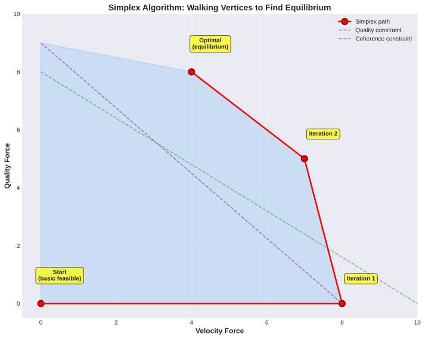

# Bhishma's Strategic Notes: PadAI + Tensegrity

*Raw strategic thinking, key questions, and mental models driving the project*

Last updated: 2025-11-16

---

## The Core Question

**How can we build reliable systems when change is accelerating, agents are executing faster than humans can review, and no single entity (human or agent) understands all the details?**

This isn't a hypothetical future problem. Early adopters are already hitting this. With Stargate's $100B capex coming online next year, this becomes everyone's problem in 12-18 months.

## Mental Models

### 1. Contracts Over Implementation Details

There are so many moving parts. The key is to **focus on contracts first, then details fall into place.**


*Component interactions showing clear contract boundaries*

**Main components:**
- **Human** (for now, one person interacting)
- **PadAI Server** (coordination infrastructure)
- **Static Vite Frontend** (visualization and steering interface)
- **Worker Agents** (Claude Code, Gemini, Cursor, Codex, even other humans!)

**Contract philosophy:** Hide complexity, only expose what each component needs to talk to others.

**Division of responsibilities:**
- **beads-mcp**: Handles task CRUD layer and OLTP interactions
- **PadAI**: Focus on managing many agents doing random stuff
  - **Observability**: You're not waiting long to know what happened
  - **Steerability**: You can adjust course in real-time

**North star for product decisions:** What are we solving? As agents scale and get better at execution, we need stable evolution of infrastructure even with many agents working together.

### 2. Nuclear Reactor Control Rods - Governance as the New Bottleneck

Execution is no longer the bottleneck - **agents handle that now**.

**The new bottleneck: How fast can the governance layer keep pace with execution?**

Think of it as **control rods in a nuclear reactor** to keep the reaction sustained, not runaway. The goal isn't to slow agents down - it's to **govern at agent velocity to get the best of both worlds**.

Traditional process (design docs, RFCs, CI) slows things down for small projects where execution matters most. But when agents do execution, the balance fundamentally shifts:
- **Execution speed**: Agent-driven, very fast (10-100x human)
- **Governance speed**: Still human-driven, lags behind

**The key insight:** Most people avoid heavy process because execution is precious. Now **execution is abundant, governance is scarce**. The constraint is governance infrastructure that keeps quality, coherence, and understanding synchronized with velocity.

**Tensegrity's role:** Provide governance that scales to agent velocity. Not slowing agents down to human review speed, but accelerating governance to match agent execution speed through:
- Automated invariant enforcement (not manual review)
- Real-time equilibrium monitoring (not periodic audits)
- Adaptive gates that tune based on metrics (not fixed thresholds)
- Active learning primitives that accelerate human understanding (not passive explanations)
- Human steering of forces, not individual decisions

### 3. Tensegrity: Stability Through Balanced Forces

**Analogy:** Tensegrity structures - held stable by multiple opposing forces, not rigid components.


*Five forces in equilibrium with human tuning controls*

**Forces in play:**
1. **Velocity Force**: Agents want to ship fast, complete tasks
2. **Quality Force**: Tests, coverage, correctness requirements
3. **Coherence Force**: Architecture consistency, API stability
4. **Learning Force**: Human understanding keeping pace with execution
5. **Scope Force**: Deadlines, priorities, focus

**Human's role:** Not to control execution directly, but to **architect the foundation and provide nudges** that keep the whole structure sustainable and adaptive to change.

**The equilibrium challenge:** Build reliable systems when change accelerates. Even the human manager might not understand all low-level details. How do we build systems that are robust, adaptable, scalable despite incomplete knowledge?

### 4. Large-Scale Codebase Principles

**Key insight:** Even if a single agent doesn't know the entire codebase, they should be able to make changes without breaking the entire system.

**This is how large codebases already work:**
- Linux kernel: subsystem maintainers, clear boundaries
- Google monorepo: architectural constraints, testing infrastructure
- Microservices: API contracts, blast radius limits

**PadAI's role:** Facilitate these best practices at agent scale.

**Potential enhancement:** Connect PadAI server to a multi-agent Agentic SDK (ADK) agent to help architect and manage worker agents. Combination of:
- **Infrastructure**: WebSockets for real-time comms
- **UI/UX**: Nudges that guide humans toward maintainable arch choices that work with multiple agents

## Economic Theory: The Constraint Shift

**This section explores the fundamental economics of agent-scale development through the lens of linear programming, shadow prices, and classic economic paradoxes.**

### Why Economics Matters Here

The shift from human-driven to agent-driven development isn't just a technical change - it's an **economic phase transition**. The constraint structure of software development has fundamentally inverted:

- **Before agents**: Execution capacity was scarce and expensive
- **After agents**: Governance capacity is scarce and expensive

Understanding this through economic theory (linear programming, Jevons paradox, Baumol cost disease) reveals WHY traditional approaches fail at agent scale and HOW Tensegrity addresses the root cause.

### Linear Programming: The Optimization Framework

**Core concept**: Linear programming (LP) finds the optimal solution to maximize/minimize an objective function subject to linear constraints.

**The setup:**
- **Decision variables**: What we can control (velocity, quality, coherence, learning, scope)
- **Objective function**: What we want to maximize (software value delivered)
- **Constraints**: Limits on resources (execution capacity, governance capacity, quality thresholds)
- **Feasible region**: All solutions that satisfy constraints (a polytope in n-dimensional space)
- **Optimal solution**: The point in the feasible region that maximizes the objective

**Example for software development:**

```
Maximize: software_value = f(velocity, quality, coherence, learning, scope)

Subject to:
  execution_hours ≤ available_human_hours     (execution constraint)
  governance_hours ≤ review_capacity          (governance constraint)
  test_coverage ≥ 75%                         (quality constraint)
  coupling_score ≤ max_coupling               (coherence constraint)
  velocity + quality ≤ 10                     (tradeoff constraint)
```

The feasible region is bounded by these constraints. The optimal point lies somewhere on the boundary (typically at a vertex).

### The Simplex Algorithm: Walking Vertices

**How LP solvers find the optimum:**

The simplex algorithm is a vertex-walking method:
1. Start at an initial vertex (basic feasible solution)
2. Identify which adjacent vertex improves the objective
3. Move along an edge to that vertex (pivot operation)
4. Repeat until no improving direction exists (optimality)


*The simplex algorithm walks vertices of the feasible polytope to find equilibrium*

**Mapping to Tensegrity:**
- Each vertex represents a different force configuration
- Moving between vertices = adjusting force intensities
- Optimal vertex = equilibrium state for your context
- Simplex navigation = how the system searches for stable configuration

**The insight**: Finding equilibrium isn't arbitrary tuning - it's solving an optimization problem with mathematical guarantees.

### Slack Variables: Measuring Unused Capacity

**What is slack?**

In linear programming, **slack variables** measure how much "room" exists in a constraint:
- If a constraint is `x ≤ 100` and the optimal solution has `x = 70`, the slack is `30`
- **Slack > 0**: Constraint is loose (not binding)
- **Slack = 0**: Constraint is tight (binding, limiting the solution)

**Before AI agents: Execution had zero slack**

```
Execution constraint: code_written ≤ 500 lines/week (human capacity)
Optimal solution: code_written = 500 lines/week
Slack in execution constraint: 0 (TIGHT - this limits everything)

Governance constraint: reviewed_code ≤ 2000 lines/week (plenty of capacity)
Optimal solution: code_written = 500, reviewed = 500
Slack in governance constraint: 1500 (LOOSE - unused capacity)
```

The execution constraint had **zero slack** - we maxed out human coding capacity. Governance had **massive slack** - code review capacity was abundant.

**After AI agents: Execution gains slack, governance loses it**

```
Execution constraint: code_written ≤ 50,000 lines/week (agent capacity)
Optimal solution: code_written = 2000 lines/week
Slack in execution constraint: 48,000 (LOOSE - agents can do way more)

Governance constraint: reviewed_code ≤ 2000 lines/week (still human capacity)
Optimal solution: code_written = 2000, reviewed = 2000
Slack in governance constraint: 0 (TIGHT - this now limits everything)
```

Now governance has **zero slack** - we max out review capacity. Execution has **massive slack** - agents could write 25x more code if governance allowed it.


*Before agents: execution constraint is tight. After agents: governance constraint is tight.*

**The constraint has FLIPPED.** What was loose is now tight. What was tight is now loose.

### Shadow Prices: What's Worth Relaxing?

**What is a shadow price?**

The **shadow price** (dual value) of a constraint tells you:
> "How much would the objective function improve if I relaxed this constraint by one unit?"

**Intuition**: If a constraint has high shadow price, that constraint is the bottleneck. Relaxing it (adding more capacity) is valuable.

**Before AI agents:**

```
Shadow price of execution constraint: $50/hour
  → Adding one more hour of human coding time is worth $50
  → This is the bottleneck - very valuable to expand

Shadow price of governance constraint: $2/hour
  → Adding one more hour of code review time is worth $2
  → This is NOT the bottleneck - low value to expand
```

**Economics**: Companies paid high salaries for engineers because execution capacity had high shadow price. Code review was seen as overhead.

**After AI agents:**

```
Shadow price of execution constraint: $3/hour
  → Adding more agent execution time is worth $3
  → Execution is abundant - low marginal value

Shadow price of governance constraint: $60/hour
  → Adding one more hour of governance capacity is worth $60
  → Governance is the bottleneck - VERY valuable to expand
```


*Shadow prices show marginal value of relaxing constraints. The bottleneck has shifted from execution to governance.*

**The insight**: Before agents, you'd pay $50 to add execution capacity and $2 for governance. Now you'd pay $60 for governance capacity and $3 for execution. The economics have inverted.

**What this means practically:**
- Hiring more engineers to write code has low ROI (execution is abundant)
- Building governance infrastructure has HIGH ROI (governance is scarce)
- Automating governance is like getting execution capacity back

### Duality: Two Ways to See the Same Problem

**What is LP duality?**

Every LP problem (primal) has a dual problem. They're mathematically equivalent but view the optimization from opposite perspectives:

- **Primal**: Maximize value given resource constraints
  - "Given our execution and governance capacity, how much software value can we create?"

- **Dual**: Minimize cost to meet requirements
  - "What's the minimum cost to achieve our quality, coherence, and velocity targets?"

**The insight**: Shadow prices come from the dual problem. They tell you the "cost" of each constraint.

**Before agents (primal view):**
```
Maximize: software_value
Subject to: execution ≤ 500 hours, governance ≤ 2000 hours
```

**Before agents (dual view):**
```
Minimize: 500 * price_execution + 2000 * price_governance
Subject to: meeting value targets
Optimal prices: price_execution = $50, price_governance = $2
```

Execution is expensive ($50/hour), governance is cheap ($2/hour).

**After agents (dual view):**
```
Minimize: 50000 * price_execution + 2000 * price_governance
Subject to: meeting value targets
Optimal prices: price_execution = $3, price_governance = $60
```

Now governance is expensive ($60/hour), execution is cheap ($3/hour).

**The duality insight**:
- The primal tells us execution was the constraint, now governance is
- The dual tells us the "shadow cost" structure has inverted
- We're not optimizing governance for its own sake - we're optimizing the SAME objective (software value), but governance is now the cost driver

### Jevons Paradox: Efficiency Increases Consumption

**The paradox**: Making something more efficient often INCREASES total consumption, not decreases it.

**Classic example**: Coal furnaces became more efficient (1800s), but total coal consumption went UP. Why? Because cheaper coal made it economical to use in more applications.

**Applied to agent coding:**

When AI agents make execution 10-100x more efficient:
- Cost per line of code drops dramatically
- But this makes it economical to write WAY more code
- Total code volume INCREASES even as per-line cost decreases


*Cheaper execution leads to more code written, not less. This is Jevons Paradox.*

**Before agents:**
- Writing 1000 lines costs 10 hours @ $50/hour = $500
- High cost limits how much code gets written
- Teams are disciplined about what to build

**After agents:**
- Writing 1000 lines costs 0.5 hours @ $3/hour = $1.50
- Low cost removes discipline - agents write everything
- Code volume explodes: "might as well add this feature too"

**The Jevons insight**: Cheap execution doesn't reduce governance burden - it INCREASES it. More code = more to review, test, maintain, understand.

**This is counterintuitive!** People expect: "Agents make coding cheaper → less governance needed." Reality: "Agents make coding cheaper → MORE code written → MORE governance needed."

### Baumol's Cost Disease: Low-Productivity Sectors Get Expensive

**The concept**: When one sector gets much more productive but another doesn't, the low-productivity sector becomes relatively more expensive.

**Classic example**: Manufacturing productivity increased 10x (automation), but healthcare productivity stayed flat (still human-intensive). Result: Healthcare became MUCH more expensive relative to manufactured goods.

**Applied to agent coding:**

- **Execution productivity**: Increased 10-100x (AI agents)
- **Governance productivity**: Mostly unchanged (still human-driven review, architecture decisions, understanding)

Result: **Governance becomes the dominant cost**, even though its absolute cost hasn't changed much.


*Cost structure before vs after agents. Governance goes from 25% to 70% of costs due to Baumol effect.*

**Before agents:**
- Total project cost: $100K
  - Execution: $60K (60%)
  - Governance: $25K (25%)
  - Other: $15K (15%)

**After agents (same total cost):**
- Total project cost: $100K
  - Execution: $15K (15%) - 10x productivity gain
  - Governance: $70K (70%) - same absolute effort, now dominates
  - Other: $15K (15%)

**The Baumol insight**: Even if governance costs stay constant in absolute terms, they become the DOMINANT cost when execution gets 10x cheaper.

**Why this matters**: Traditional advice ("reduce governance overhead") made sense when execution was 60% of costs. Now governance IS the project. You can't optimize it away - you have to make it productive.

### Combined Effect: The Governance Crisis

**When Jevons + Baumol hit together, you get a crisis:**

1. **Jevons**: Cheap execution → more code volume → more governance needed
2. **Baumol**: Governance productivity unchanged → governance costs dominate

**The result**: Governance burden explodes.


*Combined timeline showing the governance crisis: productivity divergence + volume increase*

**2020-2023**: Execution and governance productivity both low, roughly balanced
**2024**: AI agents arrive, execution productivity jumps 10x
**2025**: Code volume increases 10x (Jevons), governance burden increases 10x (Baumol)
**2026**: Governance is the bottleneck, crisis mode

**The timeline is NOW, not 5 years out.** Early adopters with 6 months of Claude Code usage are already reporting coordination challenges, mental model degradation, inability to track changes across parallel agent work.

### How Tensegrity Solves This: Economic Insights

**Understanding the economics reveals the solution path:**

#### 1. Automate Governance to Match Execution Productivity

**The Baumol solution**: Governance became expensive because its productivity didn't improve. FIX: Improve governance productivity.

- **Traditional governance**: Human code review (doesn't scale)
- **Tensegrity governance**: Automated invariant checking, CI/CD integration, real-time metrics (DOES scale)

**Effect**: Governance productivity increases 10x → governance costs drop from 70% back to ~30%

This is like automating manufacturing in the 1900s. When the low-productivity sector gets automated, Baumol cost disease reverses.

#### 2. Apply Economic Constraint to Volume (Combat Jevons)

**The Jevons solution**: Volume exploded because execution became cheap. FIX: Add back economic discipline via governance gates.

- **Without gates**: Agents write everything because marginal cost ≈ $0
- **With gates**: Governance cost per feature is visible, teams optimize for value density

**Effect**: Scope force creates back-pressure. Teams write 3x more code (not 10x), but it's high-value code.

This is like carbon pricing. When there's no cost to emissions, consumption explodes. Add a governance "price" and teams optimize.

#### 3. Use Shadow Prices to Guide Investment

**The LP solution**: Shadow prices tell you where to invest. Before agents: invest in execution. After agents: invest in governance.

- Measure shadow prices across five forces (velocity, quality, coherence, learning, scope)
- High shadow price on learning force? → Invest in active learning primitives
- High shadow price on coherence? → Invest in architectural constraints
- Governance constraint loose again? → Relax gates, allow more velocity

**Effect**: Adaptive investment. Don't guess which governance is valuable - measure shadow prices and optimize.

#### 4. Solve the Dual Problem: Minimize Governance Cost

**The duality insight**: We're not maximizing governance - we're minimizing the cost to achieve software value.

Two approaches:
- **Approach 1 (primal)**: Maximize software value given execution + governance constraints
- **Approach 2 (dual)**: Minimize governance cost to achieve value targets

Tensegrity uses the dual framing:
- What's the MINIMUM governance overhead that keeps quality, coherence, learning in bounds?
- How do we automate the expensive parts (code review, architectural checks)?
- Where do we need human judgment vs. automated gates?

**Effect**: Governance is optimized as a COST, not added for its own sake. Minimal effective governance, not maximal governance.

#### 5. Equilibrium as Vertex in Feasible Region

**The simplex insight**: Equilibrium isn't arbitrary - it's the optimal vertex of the feasible polytope.

- Each force (velocity, quality, coherence, learning, scope) is a dimension
- Constraints define the feasible region
- Equilibrium = optimal point given your context (startup vs enterprise vs OSS)
- Tuning forces = moving to a different vertex

**Profiles as different vertices:**
- **Startup profile**: High velocity, lower quality/coherence (velocity-optimized vertex)
- **Enterprise profile**: Lower velocity, high quality/coherence (stability-optimized vertex)
- **OSS profile**: Balanced, high learning (community-optimized vertex)

**Effect**: Switching profiles isn't voodoo - it's solving the LP for a different objective function. Mathematically grounded.

### What We Learned: Key Insights

**From LP theory:**
- Agent-scale development is an optimization problem with constraints
- The constraint structure has FLIPPED (execution loose, governance tight)
- Equilibrium is the optimal vertex, found via simplex-like navigation

**From shadow prices:**
- Investment priorities have inverted (execution low ROI, governance high ROI)
- Measure shadow prices across forces to guide where to improve
- Governance infrastructure has 10x ROI vs. adding more execution capacity

**From Jevons paradox:**
- Cheap execution → more code volume → more governance needed (not less!)
- Need scope discipline to prevent unbounded growth
- The paradox is already happening (early adopters drowning in PRs)

**From Baumol cost disease:**
- Governance costs dominate when execution productivity jumps
- Can't optimize governance away - must make it productive
- Automating governance reverses the cost disease

**From duality:**
- We're minimizing governance COST to achieve software value
- Not maximizing governance for its own sake
- Minimal effective governance, not maximal governance

**The synthesis:**

Tensegrity isn't solving a hypothetical future problem. It's solving the economic reality of agent-scale development:
- Execution is abundant (low shadow price, high slack)
- Governance is scarce (high shadow price, zero slack)
- Code volume is exploding (Jevons)
- Governance costs dominate (Baumol)

**The solution**: Automate governance to improve its productivity, use economic discipline (scope force) to constrain volume, measure shadow prices to guide investment, solve for minimal effective governance (dual problem).

This is the control system for high-velocity agent development, grounded in economic theory and optimization mathematics.

---

## The Epistemological Problem

**This is the deeper issue that makes agent-scale fundamentally different from human-scale development.**

### The Knowledge Representation Gap


*How representations diverge over time without governance*

**Three representations of the system:**
1. **Ground truth**: The actual code, tests, architecture, running system
2. **AI representation**: What agents "know" from training data, context windows, previous interactions
3. **Human representation**: What the human actually understands

**The problem:** As agents write code faster, these representations diverge. Error accumulates between representations.

**Why this is dangerous:**

**Traditional human delegation works because:**
- Someone's job or reputation is at stake
- Engineers take ownership, maintain standards
- SLOs and SLAs create accountability
- Consequences for poor decisions

**AI agents have no skin in the game:**
- No career impact from tech debt
- No pride in craftsmanship
- No consequence for poor decisions
- Optimize for completing task, not long-term system health

**The result:** Humans maintain code they don't deeply understand. Magnitude of tech debt is unknown because they rely on AI's assessment.

### Frameworks vs. Agent-Generated Code

**This already happens with frameworks:**
- Most code I write depends on systems I didn't implement (React, Rails, Kubernetes)
- But I can trust the framework author to handle problems
- Large community, battle-tested, well-documented

**With agents, we're entering new territory:**
- Any capable individual can implement personal customized frameworks
- Which they only partially understand
- No community, no battle-testing
- **It's YOUR codebase that you don't understand**

### Tensegrity's Role: Multi-Dimensional Governance at Agent Scale

**Core aim:** Provide governance infrastructure that keeps all five forces (velocity, quality, coherence, learning, scope) in sustainable equilibrium as agent execution accelerates.

**The governance challenge is multi-dimensional:**

1. **Quality Governance**: How do we maintain test coverage, reliability, correctness when submissions arrive 10x faster?
   - Traditional: Manual code review (doesn't scale to 100 PRs/day)
   - Tensegrity: Automated invariant enforcement, adaptive quality gates

2. **Coherence Governance**: How do we prevent architectural fragmentation when no single agent understands the whole system?
   - Traditional: Architecture review boards (too slow)
   - Tensegrity: Real-time coupling metrics, automated architectural constraint checking

3. **Learning Governance**: How do we keep human understanding synchronized with rapidly evolving codebase?
   - Traditional: Documentation, AI explanations (passive, goes stale)
   - Tensegrity: Active learning primitives, knowledge gap tracking

4. **Equilibrium Governance**: How do we balance velocity vs. quality vs. coherence vs. learning for our context?
   - Traditional: Fixed policies (startup same as enterprise)
   - Tensegrity: Tunable force profiles, adaptive mechanisms

**Why traditional approaches fail at agent scale:**
- Code review doesn't scale to 100 changes/day
- Architecture boards create bottlenecks
- Documentation goes stale immediately
- Quality gates are binary (pass/fail) not adaptive
- No visibility into equilibrium state across dimensions
- Governance is reactive (catch failures) not proactive (prevent problems)

## Active Learning: The Learning Force in Tensegrity

**Among the five governance forces, the learning force is particularly novel because existing tools don't address it at all.**

Quality governance exists (CI/CD, test coverage tools). Coherence governance exists (linters, architectural analysis tools). But **learning governance** - keeping human understanding synchronized with agent-generated code - has no existing solution.

**Core insight from learning science (Justin Skycak, Math Academy):**

**Learning requires active retrieval, not passive consumption.** This principle, grounded in decades of research, provides the foundation for Tensegrity's learning primitives.

### What Doesn't Work

- Having AI explain the code it wrote
- Reading documentation
- Watching agents work
- Reviewing diffs
- Trusting AI's explanation of the codebase

### What Does Work

- **Wrestling with the code**: Change things, break things, figure out why
- **Making predictions a priori**: Predict code behavior BEFORE running it
- **Testing predictions**: Run code, observe actual behavior
- **Updating mental models**: Compare prediction to reality, adjust understanding
- **Active retrieval**: Pull knowledge from memory, not looking it up
- **Deliberate practice**: Reps with feedback loops

### Tensegrity's Learning Primitives

**We need to think deeply about how PadAI/Tensegrity gives primitives for active learning to happen.**

**Key principle:** Don't consider learning in isolation - it's part of the tensegrity framework, balanced by other forces.

**Potential primitives:**
- Prediction challenges before agent implementation
- Comprehension sampling of agent-generated code
- Experimental sandbox for safe breaking/learning
- Knowledge gap tracking (what human knows vs. what exists)
- Understanding-gated steering (more comprehension = more control)
- Learning force that adapts based on metrics (not fixed burden)

**Adaptive mechanisms:**
- If humans skip 80% of challenges → reduce frequency
- High change rate + low understanding → surface challenges
- Startup (learning dial: 2/10) vs. Enterprise (8/10)
- 90% accuracy → increase difficulty
- 2x cycle time increase → reduce challenge frequency

**Result:** Shared representation stays in sync between human and AI. Learning overhead self-regulates to find equilibrium.

## References and Inspiration

**Learning science:**
- Justin Skycak's work: https://www.justinmath.com/
- Math Academy: Active learning platform
- "Upskilling" book: https://www.justinmath.com/books/
- Bloom's 3 Stages of Talent Development: https://www.justinmath.com/blooms-3-stages-of-talent-development/
- Deliberate practice research (Ericsson)
- Active retrieval and spaced repetition

**Field evidence:**
- Reddit power user: 6 months Claude Code, 50+ projects, coordination challenges
  https://www.reddit.com/r/ClaudeAI/comments/1oivjvm/claude_code_is_a_beast_tips_from_6_months_of/
- Early adopters already experiencing the pain

**Infrastructure timing:**
- Stargate Project: $100B capex, coming online next year
- Agent velocity will increase 10x+ when this capacity hits
- Timeline: 12-18 months to mainstream, not 5 years

## Tensegrity's Governance Capabilities


*Multi-dimensional governance: traditional approaches vs Tensegrity solutions*

**Tensegrity provides five categories of governance infrastructure:**

### 1. Invariant Enforcement
- Define rules that must hold (test coverage thresholds, API stability, dependency constraints, performance budgets, security requirements)
- Automated checking on every submission
- Violations block merge or trigger human review
- Fast feedback to agents (not hours-long review queues)

### 2. Equilibrium Monitoring
- Track system-level metrics across all five forces:
  - **Velocity**: tasks/day, cycle time, throughput
  - **Quality**: test coverage, bug escape rate, test pass rate
  - **Coherence**: coupling metrics, architectural violations, complexity trends
  - **Learning**: human understanding scores, knowledge gap alerts, prediction accuracy
  - **Scope**: backlog size, priority shifts, deadline pressure
- Real-time dashboards showing equilibrium state (healthy, degrading, unstable)
- Historical trends and anomaly detection

### 3. Automated Gates
- Integration with CI/CD pipelines
- Static analysis for architectural violations
- Performance testing against budgets
- Security scanning
- Fast pass/fail with specific violation details

### 4. Human Steering Dashboard
- Real-time view of equilibrium across all forces
- Alerts when metrics degrade beyond thresholds
- Controls to adjust invariant rules and force intensities
- Approve/block submissions that need judgment
- Tune equilibrium profiles (Startup, Enterprise, OSS)

### 5. Feedback Loops
- When submissions fail, agents get specific guidance (not vague rejections)
- Pattern libraries help agents learn conventions
- Over time, agents improve based on feedback
- Active learning challenges for humans (prediction, comprehension, experimentation)

**The key insight:** Governance isn't about slowing agents down to human review speed. It's about **automating governance to match agent velocity** while keeping humans in the loop at strategic decision points.

## Product Philosophy: Observability + Steerability

**PadAI provides both:**

**Observability:**
- Real-time view of what agents are doing
- Task graph visualization
- Metrics on velocity, quality, coupling, cycle time
- Event streams for agent actions
- You're not waiting long to know what happened

**Steerability:**
- Claim tasks, adjust priorities
- Configure invariants and thresholds
- Approve/block submissions
- Tune equilibrium forces (velocity, quality, coherence, learning)
- Intervene when metrics degrade

**UI/UX philosophy:** Nudge users toward maintainable arch choices that work with multiple agents. Don't dictate, but make the right path obvious and easy.

## Key Strategic Questions

### On Architecture

1. **Contracts**: Are we exposing the right abstractions at each layer boundary?
2. **Multi-agent ADK integration**: Should PadAI server have a meta-agent managing worker agents?
3. **WebSockets**: How do we enable real-time comms without overwhelming humans?
4. **Complexity**: What complexity should we hide vs. expose?

### On Governance

1. **Control rods**: What are the minimal effective invariants for different contexts?
2. **Equilibrium profiles**: How do we make it easy to configure Startup vs. Enterprise vs. OSS profiles?
3. **Auto-tuning**: Can Tensegrity learn optimal thresholds from metrics over time?
4. **Blast radius**: How do we limit damage from agent mistakes?

### On Learning

1. **Active learning primitives**: Which primitives have highest ROI for understanding?
2. **Measurement**: How do we measure actual understanding vs. illusion of competence?
3. **Adaptive force**: How does the system know when to increase/decrease learning challenges?
4. **Knowledge map**: How do we visualize what human knows vs. what exists in codebase?
5. **Sandbox**: What's the MVP for experimental sandbox? Containers? Branch clones?

### On Epistemology

1. **Representation error**: Can we quantify the gap between ground truth and human mental model?
2. **Critical vs. peripheral**: Which parts of codebase require deep understanding vs. fuzzy awareness?
3. **Tech debt visibility**: How do we surface invisible tech debt accumulating from agent work?
4. **Prediction accuracy**: Does prediction accuracy correlate with code quality decisions?

### On Market and Timing

1. **Early adopters**: Who are the power users hitting this pain right now?
2. **Adoption curve**: When does this go from niche to mainstream?
3. **Integration**: What tools do we need to integrate with? (GitHub, Cursor, Claude Code, Linear)
4. **Open source**: Should PadAI be OSS? What about Tensegrity?

### On Validation

1. **Hypothesis testing**: How do we validate that active learning actually improves understanding?
2. **User research**: Who should we talk to? What should we ask?
3. **Metrics**: What metrics prove this is working? (Beyond velocity and quality)
4. **Competitive landscape**: Who else is solving this? What are they missing?

## Open Research Directions

**We need deep research on:**

1. **Learning science application**
   - How does Math Academy's approach translate to codebase learning?
   - What's optimal challenge frequency before diminishing returns?
   - How do experts build mental models of large codebases?

2. **Large codebase management**
   - How do Linux, Google, large OSS projects coordinate at scale?
   - What governance patterns scale vs. become bottlenecks?
   - Validated metrics for architectural health?

3. **Human-AI collaboration**
   - What does HCI research say about AI-assisted programming?
   - Failure modes: automation complacency, skill degradation
   - How do humans stay sharp when AI automates execution?

4. **Multi-agent coordination**
   - Patterns from distributed AI, swarm intelligence
   - How do you prevent agents from working at cross purposes?
   - Game theory insights on agent incentives?

5. **Velocity-quality tradeoffs**
   - DORA metrics: what predicts high-performing teams?
   - Can you have both high velocity and high quality?
   - Which quality gates have best ROI?

6. **Competitive landscape**
   - Who is closest to solving multi-agent coordination?
   - Is anyone addressing the epistemological problem?
   - Where are the white spaces in the market?

**See `docs/research_prompt.md` for comprehensive research brief.**

## Risks and Concerns

### Technical Risks

- **Learning primitives too heavy**: Users disable them, defeats purpose
- **Doesn't actually improve understanding**: Hard to measure, might be ineffective
- **Coordination overhead**: Slows agents more than it helps
- **Complexity**: Too hard to configure equilibrium profiles correctly

### Adoption Risks

- **Too early**: Problem doesn't exist for most developers yet
- **Incumbents solve it**: GitHub/Cursor add multi-agent features before we reach market
- **Resistance**: Developers want Wild West freedom, reject governance
- **Behavior change**: Requires too much human adaptation

### Execution Risks

- **Scope too large**: Building both PadAI (infra) and Tensegrity (governance)
- **Theory vs. practice**: Learning science doesn't translate to coding context
- **Measurement challenge**: Can't validate effectiveness without good metrics
- **Integration complexity**: Too many tools to integrate with

### Market Risks

- **Niche too small**: Only power users hitting this pain
- **Agent plateau**: Capabilities don't improve as expected, velocity stays human-scale
- **Timeline shift**: Stargate delayed, infrastructure wave pushed out
- **Economic downturn**: Reduced investment in AI tooling

## What We Believe

**Thesis:**
1. Agent execution will scale 10-100x in next 12-24 months (Stargate, infrastructure investments)
2. **Governance keeping pace with execution becomes the bottleneck**
3. Multi-dimensional governance challenge: quality + coherence + learning + equilibrium tuning
4. Knowledge divergence (human not understanding codebase) is particularly insidious because it's invisible
5. Tensegrity model (balanced forces) enables stable rapid evolution at agent scale
6. Early adopters are experiencing coordination and governance pain RIGHT NOW
7. In 12-18 months, this becomes mainstream problem for all teams using AI coding tools

**If we're right:**
- Teams with PadAI + Tensegrity move 10-100x faster than those without
- Human understanding keeps pace with agent velocity
- Software evolution accelerates by order of magnitude
- We define the paradigm for agent-scale development

**If we're wrong:**
- We've built coordination infrastructure that's still useful
- We've explored a novel approach to learning at velocity
- We've identified real problems even if solution isn't perfect

## Next Steps

**Immediate (0-3 months):**
- Launch deep research effort (see research_prompt.md)
- Talk to early adopters (Claude Code power users, Cursor teams)
- Prototype minimal active learning primitive (prediction challenges?)
- Validate that coordination pain is real and measurable

**Medium-term (3-12 months):**
- MVP Tensegrity with basic invariants + one learning primitive
- Integration with PadAI for real-time governance
- User testing with small teams (2-3 agents, 1-2 humans)
- Measure: velocity, quality, AND human understanding over time

**Long-term (1-3 years):**
- Full Tensegrity with adaptive learning force
- Multiple equilibrium profiles (Startup, Enterprise, OSS)
- Ecosystem integrations (GitHub, CI/CD, monitoring)
- Generalize beyond code (infra, data pipelines, research)

## Final Thoughts

**This is fundamentally an exercise in:**
- How we build reliable systems when change accelerates 10-100x
- **How we make governance scale to match execution velocity**
- How we balance velocity, quality, coherence, learning, and scope in real-time
- How we maintain strategic control while delegating tactical execution to agents
- How we prevent invisible degradation (tech debt, knowledge gaps, coupling)

**The opportunity:**
- **No one else is solving governance at agent scale** - existing tools assume human bottleneck
- No established patterns for multi-agent coordination + multi-dimensional governance
- **Particularly** no one addressing learning governance (human understanding keeping pace)
- Infrastructure wave (Stargate) makes this urgent in 12-18 months
- Early adopters are already in pain, no good solutions exist

**The challenge:**
- We're proposing new paradigm: governance that scales to agent velocity (not slowing agents to human speed)
- Multi-dimensional problem: quality + coherence + learning + equilibrium
- Hard to measure some dimensions (understanding, architectural health)
- Need to prove adaptive governance works better than fixed policies
- Behavior change required: humans steering forces, not reviewing individual changes

**The conviction:**
- Agent scale is inevitable (Stargate, $500B investment proves it)
- **Governance at agent velocity is THE problem** - coordination, quality, coherence, learning
- Tensegrity model (balanced forces) is elegant, generalizable, grounded in real structures
- Active learning force is grounded in decades of learning science research
- Timing is right: early adopters feel pain now, mainstream in 12-18 months

---

**Let's build the control system for high-velocity agent development.**
