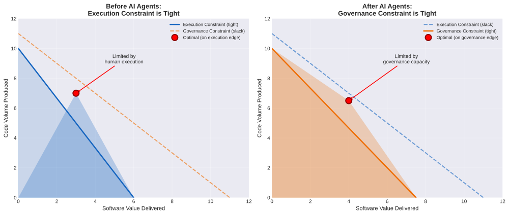
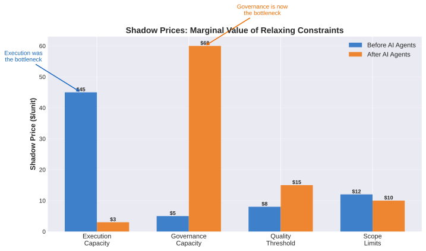
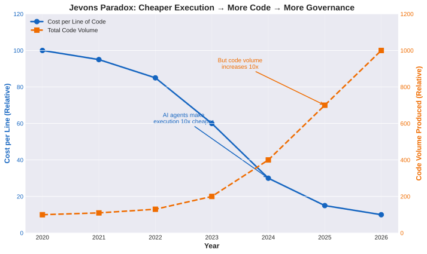
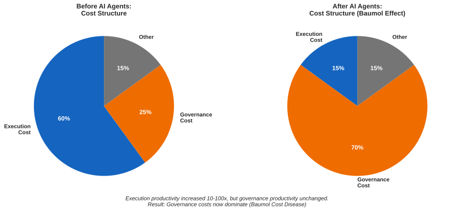
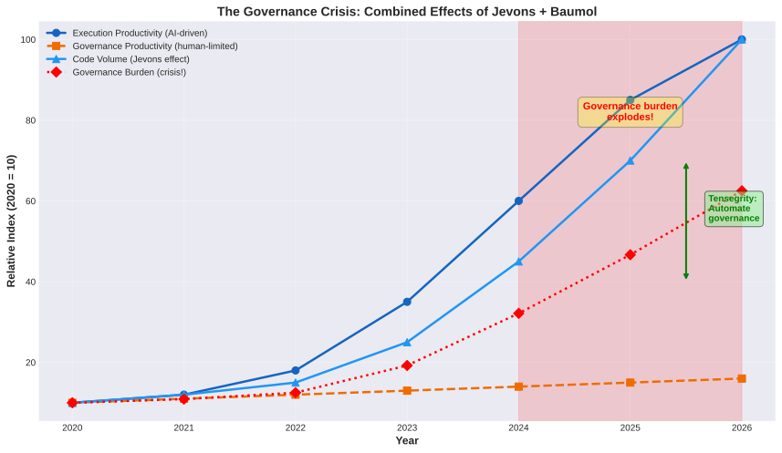

# PadAI & Tensegrity: Vision and Architecture

## The Problem Statement

As AI agents become increasingly capable at code execution, we face a new challenge: **How do we maintain stable, coherent codebases when change velocity accelerates by 10-100x?**

Traditional development assumes humans are the bottleneck in execution. We optimize for developer productivity - better IDEs, faster builds, code generation tools. But with autonomous agents, execution is no longer the constraint.

**The new bottleneck is governance keeping pace with execution.**

When agents can write code 10-100x faster than humans, the constraint shifts from "how fast can we execute?" to "how fast can we govern?" The challenge is getting the best of both worlds: **agent velocity + human governance at sustainable equilibrium**.

When 10-20 agents work simultaneously on a codebase:
- They make conflicting changes to the same modules
- They introduce architectural inconsistencies without understanding the whole system
- They create coupling and complexity that compounds over time
- They break abstractions that other agents depend on
- Quality degrades faster than any human can review

**The fundamental question:** Can we build systems that evolve rapidly while remaining stable, even when no single entity (human or agent) understands all the details?

Large-scale systems already solve this - cities, biological organisms, markets, the Linux kernel. They maintain coherence not through central control, but through **local rules that create global stability**. We need the software equivalent.

## The Economic Foundation: Why Governance Became Expensive

**Understanding the constraint shift through economics reveals why traditional approaches fail at agent scale.**

### The Constraint Has Flipped

In traditional software development, **execution was the bottleneck**. Hiring engineers cost $150K+/year because coding capacity was scarce. Code review was abundant - you could always find time to review the 2-3 PRs that arrived each week.

With AI agents, **governance is the bottleneck**. Agents can write 10-100x more code, but human review capacity hasn't increased. The constraint structure has inverted:


*Figure: Before agents, execution constrained everything. After agents, governance constrains everything.*

**Before agents:**
- Execution capacity: 500 lines/week (tight constraint, zero slack)
- Governance capacity: 2000 lines/week (loose constraint, lots of slack)
- **Bottleneck**: How fast can humans write code?

**After agents:**
- Execution capacity: 50,000 lines/week (loose constraint, massive slack)
- Governance capacity: 2000 lines/week (tight constraint, zero slack)
- **Bottleneck**: How fast can humans govern code?

This is a **constraint flip**. What was abundant is now scarce. What was scarce is now abundant.

### Shadow Prices: Investment Priorities Have Inverted

In economics, a **shadow price** tells you the marginal value of relaxing a constraint by one unit. High shadow price = valuable to expand that capacity.


*Figure: Shadow prices show where to invest. Before agents: execution. After agents: governance.*

**Before agents:**
- Shadow price of execution: $50/hour (hiring engineers very valuable)
- Shadow price of governance: $2/hour (code review capacity not valuable)
- **Implication**: Pay high salaries for engineers, treat code review as overhead

**After agents:**
- Shadow price of execution: $3/hour (adding agent capacity low value)
- Shadow price of governance: $60/hour (governance capacity very valuable)
- **Implication**: Hiring more engineers to write code has low ROI. Building governance infrastructure has HIGH ROI.

**This inverts investment priorities.** The traditional advice "hire more engineers to ship faster" no longer works. The bottleneck is governance capacity, not execution capacity. Automating governance is like getting 10x execution capacity back.

### Jevons Paradox: Cheaper Execution → More Code Volume

**The paradox**: When you make something more efficient, total consumption often INCREASES, not decreases.

Classic example: When coal furnaces became more efficient (1800s), total coal usage went UP because cheap coal made it economical to use in more applications.

**Applied to agents:**


*Figure: Cheaper execution leads to explosion in code volume. This is Jevons paradox.*

- Cost per line drops 10-100x (agents are cheap)
- This makes it economical to write WAY more code
- Code volume INCREASES even as per-line cost decreases
- Result: More code to review, test, maintain, understand

**The counterintuitive insight**: Cheap execution doesn't reduce governance burden - it INCREASES it. More code = more governance needed.

People expect: "Agents make coding cheaper → less governance needed."
Reality: "Agents make coding cheaper → MORE code written → MORE governance needed."

### Baumol's Cost Disease: Governance Costs Dominate

**The concept**: When one sector gets much more productive but another doesn't, the low-productivity sector becomes relatively more expensive.

Classic example: Manufacturing productivity increased 10x (automation), but healthcare stayed flat (human-intensive). Result: Healthcare became MUCH more expensive relative to manufactured goods.

**Applied to agents:**


*Figure: Cost structure before vs after agents. Governance goes from 25% to 70% due to Baumol effect.*

- **Execution productivity**: Increased 10-100x (AI agents)
- **Governance productivity**: Mostly unchanged (still human code review, architecture decisions)
- **Result**: Governance becomes the dominant cost, even though its absolute effort hasn't changed much

**Before agents:** Execution 60% of costs, Governance 25%
**After agents:** Execution 15% of costs, Governance 70%

**The insight**: Even if governance effort stays constant, it becomes the DOMINANT cost when execution gets 10x cheaper. Traditional advice to "reduce governance overhead" made sense when execution was 60% of costs. Now governance IS the project. You can't optimize it away - you have to make it productive.

### Combined Crisis: Jevons + Baumol

When these effects combine, you get a governance crisis:


*Figure: Timeline showing governance burden explosion from combined Jevons and Baumol effects.*

1. **Jevons**: Cheap execution → code volume increases 10x → more governance needed
2. **Baumol**: Governance productivity unchanged → governance costs dominate

**Timeline:**
- **2020-2023**: Execution and governance productivity both low, balanced
- **2024**: AI agents arrive, execution productivity jumps 10x
- **2025**: Code volume increases (Jevons), governance burden increases (Baumol)
- **2026**: Governance is the bottleneck, crisis mode

**This is happening NOW, not 5 years out.** Early adopters with 6 months of intensive Claude Code usage are already reporting coordination challenges and mental model degradation.

### How Tensegrity Solves the Economic Problem

Understanding the economics reveals the solution:

**1. Automate Governance to Reverse Baumol Cost Disease**

Governance became expensive because productivity didn't improve. FIX: Improve governance productivity.

- Traditional: Human code review (doesn't scale)
- Tensegrity: Automated invariant checking, CI/CD integration (DOES scale)
- **Effect**: Governance productivity increases 10x → costs drop from 70% back to ~30%

**2. Apply Economic Discipline to Combat Jevons**

Volume exploded because execution became cheap. FIX: Add back discipline via governance gates.

- Without gates: Agents write everything because marginal cost ≈ $0
- With gates: Governance cost per feature is visible, teams optimize for value density
- **Effect**: Scope force creates back-pressure. Teams write 3x more code (not 10x), but high-value code.

**3. Measure Shadow Prices to Guide Investment**

Shadow prices tell you where to invest:

- High shadow price on learning force? → Invest in active learning primitives
- High shadow price on coherence? → Invest in architectural constraints
- Governance constraint loose again? → Relax gates, allow more velocity

**Effect**: Adaptive investment based on where bottlenecks actually are.

**4. Minimize Governance Cost (Not Maximize Governance)**

We're not optimizing governance for its own sake. We're minimizing the cost to achieve software value.

- What's the MINIMUM governance overhead that keeps quality, coherence, learning in bounds?
- How do we automate the expensive parts (code review, architectural checks)?
- Where do we need human judgment vs. automated gates?

**Effect**: Minimal effective governance, not maximal governance.

**The synthesis**: Tensegrity solves the economic reality of agent-scale development. Execution is abundant (low shadow price, high slack). Governance is scarce (high shadow price, zero slack). Code volume is exploding (Jevons). Governance costs dominate (Baumol). The solution: Automate governance to match execution productivity, use economic discipline to constrain volume, measure shadow prices to guide investment.

---

## The Epistemological Problem

But there's a deeper problem that makes agent-scale development fundamentally different from human-scale development: **the knowledge representation gap**.

When humans write code, they build mental models of the system. When another human joins, they pair program, do code review, ask questions, gradually build their own mental model. There's shared understanding that emerges through collaboration. The team collectively "knows" the codebase.

With AI agents writing code at 10-100x velocity, this breaks down:

**The knowledge exists in three representations:**
- **Ground truth**: The actual code, tests, architecture, running system
- **AI representation**: What the agents "know" about the codebase from training data, context windows, previous interactions
- **Human representation**: What the human actually understands about what's been built

**The problem:** These representations diverge rapidly. Agents generate code faster than humans can build mental models. The human increasingly has to maintain code they don't deeply understand. This is already happening with complex frameworks (React, Rails, Kubernetes) - most developers use them without understanding internals. But with agent-generated code, it's YOUR codebase that you don't understand.

**Why this is dangerous:**
- Humans can't make good architectural decisions without understanding the system
- Tech debt accumulates invisibly - you don't know its magnitude because you're relying on AI's assessment
- When things break in unexpected ways, humans can't debug effectively
- The human becomes a manager coordinating agents they can't evaluate
- Unlike frameworks with large communities, your agent-generated codebase has a community of one (you)

**Why delegation doesn't work:**
In traditional teams, delegation works because someone's job or reputation is at stake. Engineers take ownership. But AI agents have no skin in the game - they have no consequence for poor decisions, no career impact from tech debt, no pride in craftsmanship. They optimize for completing the task, not long-term system health.


*Figure 3: How ground truth, AI representation, and human understanding diverge as agents accelerate development*

**The real challenge:** How do we accelerate human learning to keep pace with agent execution? Not to review every line, but to maintain sufficient understanding to make strategic decisions, recognize when something is fundamentally wrong, and guide the system's evolution.

This is not a solved problem. The traditional approaches don't scale:
- Code review at 100 PRs/day is impossible
- Documentation goes stale immediately
- AI-generated explanations are passive consumption - they create illusion of understanding without actual learning
- Pairing with agents doesn't work like pairing with humans - you can't learn by watching them code

## Active Learning: The Only Solution

The insight from learning science (per Justin Skycak's work on Math Academy): **Learning requires active retrieval, not passive consumption.**

You don't learn by:
- Having AI explain the code it wrote
- Reading documentation
- Watching agents work
- Reviewing diffs

You learn by:
- Making predictions about code behavior BEFORE running it
- Changing something, predicting what will break, testing the prediction
- Debugging failures and updating your mental model
- Retrieving knowledge from memory (not looking it up)
- Wrestling with the code until you can regenerate it from understanding, not just recognize it

**This is deliberate practice for codebase understanding.** Just like you can't learn tennis by watching videos, you can't learn a codebase by having AI explain it. You need reps. You need to struggle. You need feedback loops that test whether you actually understand.

**The Tensegrity role:** Provide primitives that make active learning the default, not a burden. The system should:
- Force humans to make predictions before agents execute
- Create lightweight "code comprehension challenges" that test understanding
- Track what the human knows vs. what exists in the codebase (the gap is tech debt risk)
- Surface learning opportunities from agent work (not explanations, but challenges)
- Make it easy to experiment safely (break things to see what happens)
- Reward understanding with better steering capability

**Example primitive: Prediction Protocol**
```
Agent proposes: "Add caching layer to API endpoints"
Human predicts: "This will speed up reads, might cause stale data in X scenario, will increase memory usage by ~Y"
Agent implements
System shows: Actual impact on latency, memory, where stale data occurred
Human updates mental model: Prediction was 70% correct, learned about Z edge case
```

This isn't about slowing down to review everything. It's about strategic sampling that keeps human understanding from falling too far behind. The human doesn't need to understand every detail, but they need to understand the **load-bearing concepts** - the architectural invariants, the critical paths, the areas of tech debt.

**The goal:** Minimize error between human mental model and ground truth on what matters for strategic decisions. Let details be fuzzy, but keep the architecture sharp.

## The Tensegrity Principle

Our guiding metaphor is **tensegrity** - architectural structures held stable by balanced opposing forces rather than rigid components.

In a tensegrity structure:
- Compression elements (rigid struts) push outward
- Tension elements (flexible cables) pull inward
- Stability emerges from the balance of forces
- The structure is resilient - if one cable breaks, others compensate
- You can adjust tension to change the shape while maintaining stability

Applied to agent-scale development:

**Opposing forces that create stability:**

**Velocity Force** - Agents want to move fast, complete tasks, ship features. This force drives progress.

**Quality Force** - System enforces tests, coverage, correctness. This force prevents regression.

**Coherence Force** - Architecture must remain consistent. APIs stay stable. Patterns are followed. This force prevents fragmentation.

**Learning Force** - Human understanding must keep pace with agent execution. Active learning primitives force comprehension. This force prevents knowledge divergence and invisible tech debt.

**Scope Force** - Deadlines create urgency. Priorities shift. This force drives focus.

**The human's role is not to control execution, but to adjust the tension in each cable.** If velocity is too high and quality suffers, increase the quality force (stricter tests, higher coverage). If coherence is degrading, add architectural constraints. If agents are stuck, relax constraints or provide better context.

**Equilibrium is visible through metrics** - velocity, quality, coupling, cycle time. When these are stable and healthy, the system is in equilibrium. When they degrade, adjust the forces.


*Figure 2: The five forces in equilibrium - velocity, quality, coherence, learning, and scope - with human tuning controls*

## The Two-Layer Architecture

We separate infrastructure from governance:


*Figure 1: PadAI (Layer 1 - Coordination) + Tensegrity (Layer 2 - Governance) with worker agents and external systems*

### Layer 1: PadAI (Coordination Infrastructure)

**Unopinionated infrastructure for multi-agent coordination.**

PadAI provides the primitives that enable many agents to work together without chaos. It doesn't enforce quality or architecture - it enables observability and steerability.

**Core capabilities:**

**Agent Registry and Lifecycle** - Agents register with capabilities and metadata. They send heartbeats to signal liveness. The system tracks which agents are alive, what they're working on, and their current state. When agents die or become unresponsive, tasks can be reassigned.

**Task Coordination** - Tasks can be claimed by agents based on capabilities and availability. The system prevents race conditions in claiming. Agents can submit completed work, abandon tasks, or request help. Multi-agent collaboration is supported - multiple agents can work on the same task with defined roles.

**Event Bus and Messaging** - Agents can publish events and subscribe to channels. Task-scoped message streams enable real-time coordination. The system broadcasts state changes so all interested parties stay synchronized.

**Real-time Observability** - WebSocket streams provide live updates on task status, agent activity, and system events. The frontend visualizes the dependency graph with agent assignments. Human operators can see what's happening at any moment.

**Steerability Primitives** - Humans can pause/resume individual agents or tasks. They can inject context or constraints mid-flight. They can manually reassign work or override priorities. The system is observable AND controllable.

**What PadAI does NOT do:**
- Enforce code quality requirements
- Check architectural rules
- Require reviews or approvals
- Dictate development processes
- Impose governance policies

PadAI is infrastructure. Like Kubernetes provides container orchestration without dictating what runs in containers, PadAI provides agent coordination without dictating how development happens.

### Layer 2: Tensegrity (Governance Layer)

**Opinionated governance for stable evolution at agent scale.**

Tensegrity sits on top of PadAI and adds the governance layer. It embodies principles for maintaining stability while velocity increases. It can be configured for different contexts (startup vs enterprise, open source vs proprietary).

**Core capabilities:**

**Invariant Enforcement** - Define rules that must hold: test coverage thresholds, API contract stability, dependency constraints, performance budgets, security requirements. When agents submit work, invariants are checked automatically. Violations block merge or trigger review.

**Equilibrium Monitoring** - Track system-level metrics: development velocity (tasks completed per unit time), cycle time (claim to completion), quality indicators (test coverage, bug escape rate), architectural health (coupling metrics, complexity trends), agent utilization. These metrics reveal whether the system is in healthy equilibrium.

**Automated Gates** - Integration with CI/CD pipelines to run invariant checks. Static analysis for architectural violations. Performance testing against budgets. Security scanning for vulnerabilities. Agents get fast feedback - their submission passes or fails with specific violations listed.

**Human Steering Dashboard** - Real-time view of equilibrium state (healthy, degrading, unstable). Alerts when metrics degrade beyond thresholds. Controls to adjust invariant rules and thresholds. Ability to approve/block specific submissions that need human judgment.

**Feedback Loops** - When submissions fail invariant checks, agents receive specific guidance. Pattern libraries help agents follow established conventions. Over time, agents learn what passes and improve.

**Active Learning Primitives** - Force human comprehension to keep pace with agent execution:

**Prediction Challenges**: Before agents implement changes, humans predict impact (performance, coupling, failure modes). After implementation, system shows actual outcomes. Humans update mental models based on prediction accuracy.

**Comprehension Sampling**: System randomly selects agent-generated code and quizzes human on behavior. Not "explain this" but "what happens if X changes?" Testing actual retrieval from memory, not recognition.

**Experimental Sandbox**: Safe environment to break things. Human changes code, predicts what breaks, runs tests, learns from failures. Like a gym for codebase understanding.

**Knowledge Gap Tracking**: Track which parts of codebase human has actively learned (not just reviewed). Highlight areas where human understanding lags - these are tech debt risk zones.

**Understanding-Gated Steering**: More comprehension = more control. Humans who pass comprehension challenges for a module get more authority to steer agent work in that module. Incentivizes active learning.

**What Tensegrity enforces:**
- Quality requirements (tests, coverage, documentation)
- Architectural constraints (layering, dependencies, contracts)
- Process requirements (review for large changes, migration paths for breaking changes)
- Risk management (blast radius limits, gradual rollout)
- **Human understanding requirements** (comprehension challenges before approving large changes, knowledge gap alerts)

**Tensegrity is governance.** It embodies the control rods that keep the reaction sustained - balancing velocity, quality, coherence, learning, and scope. Different Tensegrity configurations create different equilibrium points: startups move fast with minimal gates, enterprises enforce comprehensive checks, open source projects optimize for community trust.

**The core insight:** When execution is abundant (agents), governance becomes the constraint. Tensegrity provides governance infrastructure that scales with agent velocity, keeping all five forces in healthy equilibrium.

## The Contract Boundaries

Clear contracts between layers enable independent evolution and reusability.


*Figure 4: Component interactions and contract boundaries between PadAI, Tensegrity, storage, agents, and external systems*

### Storage Layer Contract (beads-mcp)

**Responsibility:** Persistent storage of tasks, dependencies, and state.

**Provides to PadAI:**
- Task CRUD operations (create, read, update, delete)
- Dependency graph management (add edges, query relationships)
- Status tracking (open, in_progress, completed, blocked)
- Efficient querying (ready tasks, blocked tasks, stats)
- Atomic updates with proper locking
- Per-project isolation via daemon model

**Does NOT provide:**
- Agent coordination logic
- Event streaming
- Real-time updates
- Governance rules

**Interface:** MCP server exposing beads_* tools (beads_create, beads_update, beads_list, beads_dep, beads_stats, etc.)

### Coordination Layer Contract (PadAI)

**Responsibility:** Multi-agent coordination, observability, and steerability.

**Provides to Agents:**

```
Agent Registration & Lifecycle
POST /agents/register
  {agent_id, capabilities: [string], metadata: {}}
  → Registers agent in system

POST /agents/heartbeat
  {agent_id, status, current_tasks: [task_id]}
  → Updates liveness and current state

GET /agents/list
  → [{agent_id, capabilities, status, last_heartbeat, current_tasks}]

Work Coordination
POST /tasks/claim
  ?capabilities=[...] &agent_id=...
  → {task: {id, title, description, context, constraints, acceptance_criteria}}
  → Assigns task to agent atomically

POST /tasks/submit
  {task_id, agent_id, changes: {files, summary}, notes}
  → Marks work as ready for review/merge

POST /tasks/abandon
  {task_id, agent_id, reason}
  → Releases task back to ready pool

Communication & Events
POST /events/publish
  {type, task_id?, agent_id?, message, metadata}
  → Publishes event to interested subscribers

GET /events/poll
  ?since=timestamp &filter={...}
  → Retrieves events since last poll

WS /stream
  → Real-time event stream (task updates, agent activity, submissions)

Collaboration
POST /tasks/collaborate
  {task_id, agent_id, role}
  → Adds agent as collaborator with specific role

POST /tasks/decompose
  {task_id, subtasks: [{title, context, assignee?}]}
  → Creates child tasks and establishes dependencies
```

**Provides to Humans (Frontend):**

```
Observability
GET /status
  → {agents_alive, tasks_ready, tasks_in_progress, tasks_completed}

GET /tasks/graph
  → Full dependency graph with agent assignments

WS /observe
  → Real-time feed of all agent activity

GET /tasks/{id}/events
  → Timeline of all events for a task

Steerability
POST /control/pause
  {agent_id or task_id}
  → Pauses agent or prevents task from being claimed

POST /control/resume
  {agent_id or task_id}

POST /control/reassign
  {task_id, from_agent, to_agent?}
  → Manually reassign work

POST /control/inject
  {task_id, constraints: [...], context_files: [...]}
  → Add guidance to active task
```

**Provides to Tensegrity:**

```
Submission Monitoring
GET /submissions/pending
  → All submitted work awaiting approval

POST /submissions/{id}/approve
  → Mark submission as approved, complete task

POST /submissions/{id}/block
  {violations: [...]}
  → Block merge, notify agent of issues

Event Subscriptions
WS /events/subscribe
  filter: {type: "submission", ...}
  → Tensegrity receives all submissions in real-time
```

**Consumes from beads-mcp:**
- beads_create, beads_update, beads_list for task management
- beads_dep for dependency queries
- beads_stats for aggregate status

**Does NOT provide:**
- Invariant checking
- Code quality gates
- Architectural validation
- CI/CD integration

### Governance Layer Contract (Tensegrity)

**Responsibility:** Enforce invariants, monitor equilibrium, enable human steering.

**Provides to PadAI (via webhook/API):**

```
Submission Review
POST /review/check
  {submission_id, task_id, changes: {files, diff, tests}}
  → {approved: bool, violations: [{rule, severity, message}], metrics: {...}}

GET /review/{submission_id}/status
  → Current status of review (pending, approved, blocked)
```

**Provides to Humans (Dashboard):**

```
Equilibrium Monitoring
GET /equilibrium/metrics
  → {
      velocity: {tasks_per_day, trend},
      quality: {coverage, bug_rate, test_pass_rate},
      coherence: {coupling_score, contract_violations},
      cycle_time: {p50, p95, trend},
      agent_utilization: {...}
    }

GET /equilibrium/status
  → {state: "stable"|"degrading"|"unstable", alerts: [...]}

WS /equilibrium/stream
  → Real-time metric updates

Invariant Management
GET /invariants/list
  → [{id, type, threshold, enabled, violation_count}]

POST /invariants/configure
  {invariant_id, threshold, enabled}
  → Adjust rules dynamically

GET /invariants/violations
  → Recent violations with context

Steering Controls
POST /control/adjust
  {metric: "coverage_threshold", value: 75}
  → Tune equilibrium forces

POST /control/override
  {submission_id, action: "approve", reason}
  → Human override for exceptions

GET /control/history
  → Log of human interventions

Active Learning
POST /learning/predict
  {task_id, human_prediction: {performance_impact, failure_modes, coupling_changes}}
  → Register prediction before agent implements
  → After implementation, compare prediction to actual outcomes

GET /learning/challenge
  → Returns comprehension challenge: code snippet + "what breaks if X changes?"
  → Human answers, system checks correctness via test execution

POST /learning/experiment
  {module, hypothesis: "changing X will break Y"}
  → Spin up sandbox, human makes change, system runs tests
  → Shows what actually broke, human updates model

GET /learning/knowledge_map
  → {modules: [{name, human_understanding: 0-100, last_tested, risk_score}]}
  → Visualization of which areas human deeply understands vs. not

GET /learning/gaps
  → Modules with low understanding + high change frequency = risk
  → Surfaces learning opportunities

POST /learning/attest
  {module, challenge_id, answer}
  → Human completes challenge, earns comprehension credit
  → Unlocks steering authority for that module
```

**Consumes from PadAI:**
- Subscribes to submission events
- Queries task and agent status
- Approves/blocks submissions

**Does NOT provide:**
- Direct agent coordination
- Task storage
- Event bus

## Information Flow


*Figure 5: Agent submission flow through Tensegrity governance with automated checks and human learning challenges*

### Agent Claims Work
```
Agent → PadAI: POST /tasks/claim {agent_id, capabilities}
PadAI → beads-mcp: beads_list(status=ready) + dependency check
PadAI → PadAI: Match task to agent capabilities
PadAI → beads-mcp: beads_update(task_id, status=in_progress, assignee=agent_id)
PadAI → Agent: {task with context, constraints, acceptance_criteria}
PadAI → Frontend (WS): {event: "task_claimed", task_id, agent_id}
```

### Agent Submits Work
```
Agent → PadAI: POST /tasks/submit {task_id, changes, notes}
PadAI → PadAI: Store submission metadata
PadAI → Tensegrity (WS): {event: "submission", submission_id, task_id, changes}
Tensegrity → Tensegrity: Run invariant checks (tests, coverage, contracts, coupling)
Tensegrity → CI/CD: Trigger checks (tests, static analysis, security scan)
CI/CD → Tensegrity: Results
Tensegrity → PadAI: POST /submissions/{id}/approve OR /block {violations}
PadAI → beads-mcp: beads_update(task_id, status=completed) [if approved]
PadAI → Agent: Notification (approved or violations to fix)
PadAI → Frontend (WS): {event: "task_completed" or "submission_blocked"}
```

### Human Adjusts Equilibrium
```
Human → Tensegrity UI: Observes coupling_score increasing
Tensegrity → Human: Alert "Coupling degrading, consider adding dependency gate"
Human → Tensegrity: POST /invariants/configure {dependency_depth_limit: 3}
Tensegrity → Tensegrity: Update enforcement rules
Tensegrity → PadAI (WS): Future submissions checked with new rule
```

### Active Learning Flow (Prediction Challenge)
```
Agent claims task: "Implement Redis caching for API endpoints"
Tensegrity → Human: "Predict impact before implementation"
Human → Tensegrity: POST /learning/predict {
  performance_impact: "50% latency reduction on reads",
  failure_modes: "stale data if cache invalidation fails",
  coupling_changes: "adds Redis dependency to API layer"
}
Agent implements caching
Tensegrity observes actual metrics:
  - Latency reduced 60% (prediction: 50%) ✓
  - Stale data occurred in user profile endpoint (predicted) ✓
  - Also increased memory usage 200MB (not predicted) ✗
  - Coupling to Redis matches prediction ✓
Tensegrity → Human: "Prediction 75% accurate. Key miss: memory impact. Update model."
Human: "Learned: caching has memory cost, need to predict that next time"
Tensegrity updates knowledge map: human understanding of caching: 85/100
```

### Active Learning Flow (Comprehension Sampling)
```
Agent recently changed auth module (5 files, 300 lines)
Tensegrity → Human: GET /learning/challenge
  Challenge: "If Session.user_id field changes from string to int, what breaks?"
Human → Tensegrity: "User lookups in database, JWT token parsing, session serialization"
Tensegrity spins sandbox, makes change, runs tests
Actual breaks: User lookups ✓, JWT parsing ✓, session serialization ✓, ALSO: API contract validation ✗
Tensegrity → Human: "80% correct. Missed: API contracts. Here's the test failure."
Human reviews failure, updates mental model
Tensegrity updates knowledge map: auth module understanding: 80/100
```

### Active Learning Flow (Experimental Sandbox)
```
Human curious: "What happens if I remove this error handler?"
Human → Tensegrity: POST /learning/experiment {
  hypothesis: "Removing ErrorBoundary will crash entire app on component error"
}
Tensegrity → Sandbox: Create isolated env, human makes change
Human runs tests in sandbox
Result: Only that component crashes, app continues (hypothesis wrong!)
Tensegrity → Human: "Error isolation works differently than you thought. See test results."
Human: "Learned: React error boundaries scope errors to subtrees, not whole app"
Tensegrity updates knowledge map: React error handling: 90/100
```

### Agents Collaborate
```
Agent-A → PadAI: POST /tasks/collaborate {task_id, agent_id: agent-B, role: reviewer}
PadAI → beads-mcp: beads_update(task_id, assignees: [agent-A, agent-B])
PadAI → Agent-B: Notification "Invited to collaborate on task-X as reviewer"
Agent-A → PadAI: POST /events/publish {task_id, message: "Implemented auth, ready for review"}
PadAI → Agent-B (WS): Event delivered
Agent-B → PadAI: POST /events/publish {task_id, message: "Looks good, approved"}
Agent-A → PadAI: POST /tasks/submit {task_id, ...}
[Standard submission flow]
```

## Design Principles

### For PadAI: Primitives, Not Policy

PadAI provides low-level coordination primitives. It should be usable for many different governance models - lightweight for startups, heavyweight for regulated industries, experimental for research.

**Principle:** Mechanism, not policy. Provide the tools for coordination and observation. Let Tensegrity (or other layers) define the rules.

**Examples:**
- PadAI tracks agent heartbeats → Tensegrity decides what to do about dead agents
- PadAI enables task submission → Tensegrity decides if it's acceptable
- PadAI shows task graph → Tensegrity measures coupling and enforces limits
- PadAI allows pausing agents → Tensegrity triggers pauses based on violations

### For Tensegrity: Equilibrium, Not Control

Tensegrity doesn't micromanage. It defines invariants and monitors equilibrium. Humans adjust forces, not individual decisions.

**Principle:** Set the rules of the game, let agents play within them. Intervene only when equilibrium degrades.

**Examples:**
- Don't review every change → Define test coverage threshold, auto-pass if met
- Don't assign tasks manually → Let agents claim based on capabilities
- Don't approve small PRs → Auto-merge if all invariants pass
- Don't dictate architecture → Enforce architectural constraints, let agents design within them

### For Tensegrity: Learning as Adaptive Force, Not Fixed Burden

Active learning requirements are not static overhead - they're a tunable force in the equilibrium system. The system adjusts learning intensity based on observed metrics and context.

**Principle:** Learning force scales with risk and adapts to human capacity. Too heavy and velocity suffers; too light and knowledge divergence creates invisible tech debt.

**Adaptive mechanisms:**
- **Completion rate feedback**: If humans skip 80% of challenges, system auto-reduces frequency
- **Knowledge gap alerts**: High change rate + low understanding = automatically surface targeted challenges
- **Context-based tuning**: Startup profile (learning dial: 2/10), Enterprise profile (learning dial: 8/10)
- **Performance-based adjustment**: Humans crushing challenges at 90% accuracy → increase difficulty and depth
- **Velocity monitoring**: If cycle time increases 2x after adding challenges → reduce challenge frequency

**Result:** Learning overhead self-regulates. System finds equilibrium where human understanding keeps pace with agent execution without becoming a bottleneck. This is fundamentally different from static code review, which doesn't adapt to load or effectiveness.

### For Both: Observability First

You can't steer what you can't see. Every action, every state change, every decision should be observable.

**Principle:** Make everything visible. Logs, metrics, events, traces. Build dashboards before automation.

**Examples:**
- Every task transition emits an event
- Every invariant check logs results
- Every human intervention is recorded
- Metrics are real-time and historical
- Agent activity is always visible

### For Both: Fast Feedback Loops

Agents should know immediately if their work is acceptable. Waiting hours for review kills velocity.

**Principle:** Automated checks are fast. Agents iterate quickly. Humans intervene only on exceptions.

**Examples:**
- Invariant checks run in seconds/minutes, not hours
- Test suites are parallelized and cached
- Submission approval/block happens automatically when possible
- Agents see violations with specific guidance, not vague rejections

### For Both: Graceful Degradation

Individual failures shouldn't cascade. The system should be resilient to agents dying, submissions failing, or humans being unavailable.

**Principle:** No single point of failure. Work continues even when components fail.

**Examples:**
- If agent dies mid-task, work is released for re-claim
- If Tensegrity is down, PadAI continues coordination (just no governance)
- If tests fail, submission is blocked but other work continues
- If human is unavailable, auto-approve low-risk changes

## Use Cases and Equilibrium Profiles

Different contexts require different equilibrium points. Tensegrity should support multiple profiles.


*Figure 6: Startup vs Enterprise equilibrium profiles showing different force intensity settings and target metrics*

### Startup Profile: Maximum Velocity

**Forces:**
- Velocity: Maximum (ship fast, iterate)
- Quality: Minimal gates (tests exist, but low coverage threshold)
- Coherence: Loose (architectural consistency comes later)
- Learning: Lightweight (prediction challenges on critical paths only)
- Scope: Aggressive deadlines

**Invariants:**
- Tests must pass (but coverage can be 40%)
- No security vulnerabilities (critical/high)
- Breaking changes allowed (it's early, APIs unstable)
- Small PR size limit relaxed
- Auto-merge if tests pass
- Prediction challenge for changes to core auth/payment logic only

**Equilibrium metrics:**
- Velocity: 50+ tasks/day target
- Cycle time: <2 hours preferred
- Bug rate: Acceptable if not blocking users
- Human understanding of critical paths: >70%

**Human role:** Set direction, unblock agents, make product calls. Minimal review. Stay sharp on core business logic through lightweight prediction challenges.

### Enterprise Profile: Stability and Compliance

**Forces:**
- Velocity: Moderate (steady progress)
- Quality: High (extensive testing, documentation required)
- Coherence: Strict (architecture must be consistent)
- Learning: Comprehensive (regular comprehension sampling, mandatory for approvals)
- Compliance: Audit trails, review required

**Invariants:**
- Test coverage >80%
- All breaking changes require migration path
- API contracts versioned
- Security scan clean (no critical/high/medium)
- Performance budgets enforced
- Large changes require human review AND comprehension challenge
- Architectural layers enforced
- Human understanding score >60% for all modified modules before approval

**Equilibrium metrics:**
- Velocity: 10-20 tasks/day acceptable
- Cycle time: <1 day preferred
- Bug rate: Very low tolerance
- Human knowledge map coverage: >80% of active modules
- Knowledge gap alert response time: <24 hours

**Human role:** Review exceptions, approve breaking changes, audit compliance. Strategic architecture. Maintain deep understanding through regular comprehension sampling. Cannot approve changes in modules they haven't passed challenges for.

### Open Source Profile: Transparent and Democratic

**Forces:**
- Velocity: Community-driven
- Quality: High bar for merges
- Coherence: Maintainers guide architecture
- Community: Anyone can contribute

**Invariants:**
- Tests required, high coverage
- Documentation updated
- Contribution guidelines followed
- Maintainer approval required
- Public review before merge

**Equilibrium metrics:**
- Contributor count
- Review queue depth
- Time to first response

**Human role:** Maintainers steer architecture, review contributions, build consensus.

## The Vision

**Near-term (6-12 months):**

PadAI becomes the coordination layer for agent teams. You spin up 5-10 agents, point them at a task queue, and they work in parallel. You watch progress in real-time on a graph. When conflicts arise, you intervene. The system is observable and steerable.

Tensegrity adds basic governance. Test coverage is enforced. Breaking changes are caught. Large PRs trigger review. You see equilibrium metrics and adjust thresholds. Velocity stays high while quality doesn't degrade.

**Critically, Tensegrity introduces active learning primitives.** Before agents implement changes to critical paths, you make predictions about impact. After implementation, you see how your predictions compared to reality. The system tracks which parts of the codebase you understand vs. which are mysterious black boxes. When tech debt risk is high (low understanding + high change rate), you get alerts. You can't approve changes in areas you don't understand without passing comprehension challenges. This keeps your mental model synchronized with the rapidly evolving codebase.

**Mid-term (1-2 years):**

PadAI supports complex collaboration patterns. Agents decompose epics, hand off work in phases, pair-program on difficult tasks, and discover patterns they share with the swarm. The meta-architect agent runs inside PadAI, helping decompose work and check submissions.

Tensegrity becomes smarter. It learns from history - if certain types of changes always fail tests, it warns agents proactively. It auto-tunes thresholds based on observed metrics. It detects architectural drift before it becomes a problem. Different teams use different Tensegrity profiles.

**Active learning becomes deeply integrated.** Tensegrity analyzes your prediction accuracy over time and identifies your knowledge blind spots. It generates targeted comprehension challenges based on recent agent work. The experimental sandbox becomes a full "codebase gym" where you can safely break things to learn. Understanding gates become granular - different modules require different comprehension levels to approve changes. The system gamifies learning - completing challenges unlocks steering authority, creating intrinsic motivation to stay sharp. Your knowledge map becomes as important as the codebase dependency graph.

**Long-term (2-5 years):**

This model generalizes beyond code. PadAI coordinates agents working on any decomposable problem - architecture design, infrastructure management, data pipelines, research projects. Tensegrity enforces domain-specific invariants.

The pattern becomes common: when you need many autonomous agents to work together at high velocity, you use coordination infrastructure (PadAI-like) plus governance layer (Tensegrity-like). The tensegrity principle - balanced forces creating stability - applies to any multi-agent system.

**The ultimate goal:** Prove that you CAN evolve complex systems rapidly with autonomous agents, while maintaining stability, without central bottlenecks. Show that governance at agent scale is possible, practical, and generalizable.

## Why This Matters

AI agents will get better at execution. The constraint isn't coding ability anymore - **it's governance keeping pace with agent velocity**. Teams that solve multi-agent governance will move 10-100x faster than teams that don't.

**Current approaches don't scale:**
- Single-agent systems (GitHub Copilot, Cursor) don't coordinate multiple agents
- CI/CD catches failures but doesn't prevent them or guide agents proactively
- Code review doesn't scale to 100 changes/day - humans can't keep up
- Microservices enable parallel work but don't govern coherence across boundaries
- Quality gates (tests, coverage) exist but aren't adaptive to agent velocity
- AI explanations create illusion of understanding without actual learning
- Passive documentation becomes stale immediately at agent velocity
- No infrastructure for balancing velocity vs. quality vs. coherence in real-time

**The governance challenge is multi-dimensional:**


*Figure 7: Five dimensions of governance at agent scale showing traditional approaches that fail vs Tensegrity solutions*

1. **Coordination**: How do you prevent 20 agents from conflicting, duplicating work, or breaking each other's changes?
2. **Quality**: How do you maintain test coverage, correctness, and reliability when submissions arrive 10x faster?
3. **Coherence**: How do you prevent architectural fragmentation when no single agent understands the whole system?
4. **Learning**: How do you keep human understanding synchronized with rapidly evolving codebase?
5. **Equilibrium**: How do you tune the balance between these forces for your context (startup, enterprise, OSS)?

**The epistemological problem (human understanding lag) is particularly insidious** because it's invisible. Quality degradation shows up in test failures. Architectural decay shows up in coupling metrics. But knowledge divergence is silent until the human makes a catastrophically bad decision because they don't understand the system they're governing. Agents write code faster than humans build mental models. The codebase becomes a black box maintained by AI, guided by a human who's flying blind.

**PadAI + Tensegrity provide the missing governance layer.**

PadAI solves coordination: observability and steerability for multi-agent teams.

Tensegrity solves governance at scale: it keeps all five forces (velocity, quality, coherence, learning, scope) in sustainable equilibrium. It provides:
- **Invariant enforcement** that scales to agent velocity (automated gates, not manual review)
- **Equilibrium monitoring** that shows when forces are out of balance
- **Adaptive mechanisms** that tune governance based on metrics and context
- **Active learning primitives** that keep human understanding synchronized with ground truth
- **Human steering dashboard** for adjusting forces without micromanaging

This is infrastructure for the next era of software development - where agents execute at 10-100x human velocity, and governance scales to match. Where humans steer with actual understanding, not blind trust. Where quality, coherence, and velocity aren't trade-offs but balanced forces in healthy equilibrium.

**If we get this right:** Software evolution accelerates by an order of magnitude while remaining stable, coherent, and human-understood.

**If we don't:** Agent-generated codebases become unmaintainable messes - fast execution, broken architecture, invisible tech debt, humans who don't understand what they're approving.

## Empirical Evidence and Timing

### The Problem Exists Today

Agent-scale development is not speculative - it's happening now among early adopters pushing AI coding tools to their limits.

**Field reports from practitioners:**
- A developer managing 6 months of intensive Claude Code usage across 50+ projects reports challenges maintaining mental models, tracking changes across parallel agent work, and coordinating multiple agents effectively ([Reddit: Claude Code is a beast](https://www.reddit.com/r/ClaudeAI/comments/1oivjvm/claude_code_is_a_beast_tips_from_6_months_of/))
- These power users are already experiencing the coordination and knowledge divergence problems PadAI + Tensegrity solve

**AI code generation has crossed the adoption threshold:**
- Over 15 million developers using GitHub Copilot by early 2025 (400% growth in 12 months)
- 63% of professional developers currently use AI in development, with another 14% planning to adopt soon (Stack Overflow 2024 Developer Survey)
- Copilot now writes nearly half of a developer's code on average (46%), with Java developers seeing up to 61% AI-generated code
- Developers accept ~30% of AI suggestions and keep 88% of AI-generated code in final submissions
- Code velocity: Copilot users reduce time-to-PR from 9.6 days to 2.4 days (55% faster)

Sources: [LinearB Blog on Copilot ROI](https://linearb.io/blog/is-github-copilot-worth-it), [GitHub Research with Accenture](https://github.blog/news-insights/research/research-quantifying-github-copilots-impact-in-the-enterprise-with-accenture/), [Copilot Usage Statistics 2025](https://www.wearetenet.com/blog/github-copilot-usage-data-statistics)

**Code quality concerns emerging:**
- AI-generated code has 41% higher churn rate than human-written code, indicating lower initial quality and more frequent revisions
- This validates the governance thesis: velocity without quality gates creates technical debt

Source: [GitClear AI Code Quality Research 2025](https://www.gitclear.com/ai_assistant_code_quality_2025_research)

### Agent-Scale Infrastructure is Imminent

The industry is making $500B+ bets on agent-scale compute infrastructure arriving in the next 1-4 years.

**Stargate Project:** $500 billion investment over 4 years building AI infrastructure for OpenAI in the United States, with $100 billion deployed immediately. Partnership between SoftBank, OpenAI, Oracle, and UAE's MGX fund. Construction began January 2025 in Abilene, Texas, with completion expected before end of 2025. Expansion to 7 gigawatts of planned capacity across multiple US sites.

**This is not a bet on "maybe agents will be useful someday."** This is infrastructure for agent-scale compute as the next platform. When this capacity comes online, agent velocity will increase 10x+ overnight.

Source: [OpenAI Stargate Announcement](https://openai.com/index/announcing-the-stargate-project/), [CNN Business on Stargate](https://www.cnn.com/2025/01/21/tech/openai-oracle-softbank-trump-ai-investment)

**Timeline:** We're not building for a problem 5 years out. Early adopters are hitting these pain points today. In 12-18 months, as Stargate infrastructure comes online, this becomes mainstream.

### Scientific Backing for Active Learning Approach

The active learning primitives in Tensegrity are grounded in established learning science, not speculation.

**Deliberate practice theory (Ericsson et al., 1993):**
- Individual differences in expert performance are closely related to accumulated deliberate practice - activities specifically designed to improve performance through mindful repetition and feedback
- Key characteristics: individualized training, immediate feedback, pushing beyond comfort zone, performance-focused rather than enjoyment-focused
- Applies across domains from athletics to music to intellectual skills

"Deliberate practice is not inherently enjoyable. Individuals are motivated to practice because practice improves performance." - Ericsson, Krampe, & Tesch-Römer (1993)

Sources: [Original Deliberate Practice Paper](https://www.ida.liu.se/~nilda08/Anders_Ericsson/Ericsson_delib_pract.pdf), [Royal Society review of deliberate practice research](https://royalsocietypublishing.org/doi/10.1098/rsos.190327)

**Active retrieval and spaced repetition:**
- Retrieval practice (actively recalling information from memory) enhances learning far more than passive rereading or recognition
- Spacing effect: Practicing skills distributed over time is more effective than massed practice in single sessions
- Cognitive load theory: Spacing allows cognitive resources to replenish, preventing overload and enabling deeper processing
- Mechanism: Attempting to recall fuzzy memories triggers effortful reconstruction of retrieval pathways, strengthening long-term encoding

"Over time, memories decay and become less accessible; by attempting to relearn something after a period of time we are actually reconstructing the information itself and the pathways that lead to it." - Educational research on spacing effects

Sources: [Australian Education Research on Spacing & Retrieval](https://www.edresearch.edu.au/summaries-explainers/explainers/spacing-retrieval), [NIH research on spaced learning mechanisms](https://www.ncbi.nlm.nih.gov/pmc/articles/PMC5126970/)

**Application to Tensegrity:**
- **Prediction challenges** = deliberate practice for architectural reasoning
- **Comprehension sampling** = spaced retrieval practice on codebase knowledge
- **Experimental sandbox** = immediate feedback loop for hypothesis testing
- **Knowledge gap tracking** = individualized training based on performance assessment

The system operationalizes learning science principles that have decades of empirical validation. This is not "gamification" or "engagement tricks" - it's applying evidence-based pedagogy to the problem of human comprehension at agent velocity.

### Why Now is the Right Time

**Not too early:** Problem exists for power users today. Early adopters are already experiencing coordination chaos and knowledge divergence with current AI coding tools.

**Not too late:** Solutions aren't ossified. No established patterns for multi-agent coordination or human learning at agent velocity. Opportunity to define the paradigm.

**Infrastructure wave incoming:** Stargate and similar investments will create 10x agent velocity increase in 12-24 months. Teams without governance + learning infrastructure will drown. Those with PadAI + Tensegrity will compound advantages.

**Market timing:** Target early adopters using Claude Code / Cursor / Copilot at scale NOW. They're feeling the pain. In 12-18 months, this becomes everyone's problem. Be the solution before they know they need it.

---

**PadAI: Coordination infrastructure for multi-agent teams.**
**Tensegrity: Governance for stable evolution at agent scale.**
**Together: The control system for high-velocity development.**

## References

**AI Infrastructure & Adoption:**
- OpenAI. (2025). Announcing The Stargate Project. https://openai.com/index/announcing-the-stargate-project/
- LinearB. (2024). Is GitHub Copilot worth it? ROI & productivity data. https://linearb.io/blog/is-github-copilot-worth-it
- GitHub. (2024). Research: Quantifying GitHub Copilot's impact in the enterprise with Accenture. https://github.blog/news-insights/research/research-quantifying-github-copilots-impact-in-the-enterprise-with-accenture/
- GitClear. (2025). AI Copilot Code Quality: 2025 Data Suggests 4x Growth in Code Clones. https://www.gitclear.com/ai_assistant_code_quality_2025_research

**Learning Science:**
- Ericsson, K. A., Krampe, R. T., & Tesch-Römer, C. (1993). The role of deliberate practice in the acquisition of expert performance. Psychological Review, 100(3), 363-406.
- Macnamara, B. N., & Maitra, M. (2019). The role of deliberate practice in expert performance: revisiting Ericsson, Krampe & Tesch-Römer (1993). Royal Society Open Science, 6(8), 190327.
- Australian Education Research Organisation. (2024). Spacing and retrieval. https://www.edresearch.edu.au/summaries-explainers/explainers/spacing-retrieval
- Smolen, P., Zhang, Y., & Byrne, J. H. (2016). The right time to learn: mechanisms and optimization of spaced learning. Nature Reviews Neuroscience, 17(2), 77-88.

**Practitioner Reports:**
- Reddit /r/ClaudeAI. (2024). Claude Code is a beast: Tips from 6 months of experience managing 50+ projects. https://www.reddit.com/r/ClaudeAI/comments/1oivjvm/claude_code_is_a_beast_tips_from_6_months_of/
