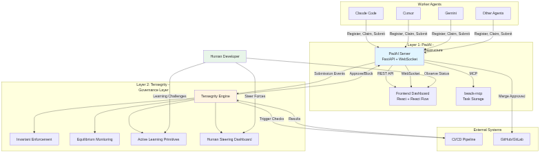

# PadAI + Tensegrity Diagrams

This directory contains Mermaid source files for all diagrams used in the vision and strategy documentation.

## Available Diagrams

1. **architecture-overview.mmd** - Two-layer architecture showing PadAI (coordination) + Tensegrity (governance) with all components
2. **tensegrity-forces.mmd** - The five forces in equilibrium (velocity, quality, coherence, learning, scope) and human tuning
3. **knowledge-gap.mmd** - Epistemological problem: how ground truth, AI representation, and human understanding diverge over time
4. **submission-flow.mmd** - Sequence diagram showing agent submission → Tensegrity governance → approval/block flow
5. **equilibrium-profiles.mmd** - Comparison of Startup vs Enterprise force settings and metrics
6. **governance-challenge.mmd** - Multi-dimensional governance challenge showing 5 dimensions and traditional vs Tensegrity approaches
7. **component-contracts.mmd** - Component interaction diagram with contracts between layers

## Directory Structure

```
docs/diagrams/
├── source/              # Mermaid .mmd source files (version controlled)
│   ├── architecture-overview.mmd
│   ├── tensegrity-forces.mmd
│   ├── knowledge-gap.mmd
│   ├── submission-flow.mmd
│   ├── equilibrium-profiles.mmd
│   ├── governance-challenge.mmd
│   └── component-contracts.mmd
├── generate.sh          # Script to generate PNG/SVG from source
└── README.md            # This file

docs/assets/images/      # Generated PNG/SVG files (committed for convenience)
├── architecture-overview.png
├── architecture-overview.svg
├── tensegrity-forces.png
├── tensegrity-forces.svg
└── ...
```

## Generating Images

### Prerequisites

Install Mermaid CLI:

```bash
npm install -g @mermaid-js/mermaid-cli
```

### Generate All Diagrams

```bash
cd docs/diagrams
./generate.sh
```

This creates both PNG (for GitHub/docs) and SVG (scalable for web) versions in `docs/assets/images/`.

### Generate Single Diagram

```bash
cd docs/diagrams
mmdc -i source/architecture-overview.mmd -o ../assets/images/architecture-overview.png -w 1200 -H 800 -b transparent
```

### Online Alternative

If you can't install mermaid-cli, you can:

1. Open https://mermaid.live/
2. Paste the content of any `.mmd` file
3. Download the rendered PNG/SVG

## Editing Diagrams

1. Edit the `.mmd` source file in `source/`
2. Run `./generate.sh` to regenerate images
3. Commit both source and generated images

## Mermaid Syntax

All diagrams use Mermaid diagram syntax:
- **Graph TB/LR**: Flowcharts and component diagrams
- **sequenceDiagram**: Sequence/flow diagrams
- **Styling**: Inline `style` directives for colors

Learn more: https://mermaid.js.org/intro/

## Integration with Docs

These diagrams are referenced in:
- `docs/design/vision_architecture.md`
- `docs/design/bhishma_strategic_notes.md`

Using standard Markdown image syntax:
```markdown

```

For GitHub, use relative paths. For other renderers, adjust paths as needed.
