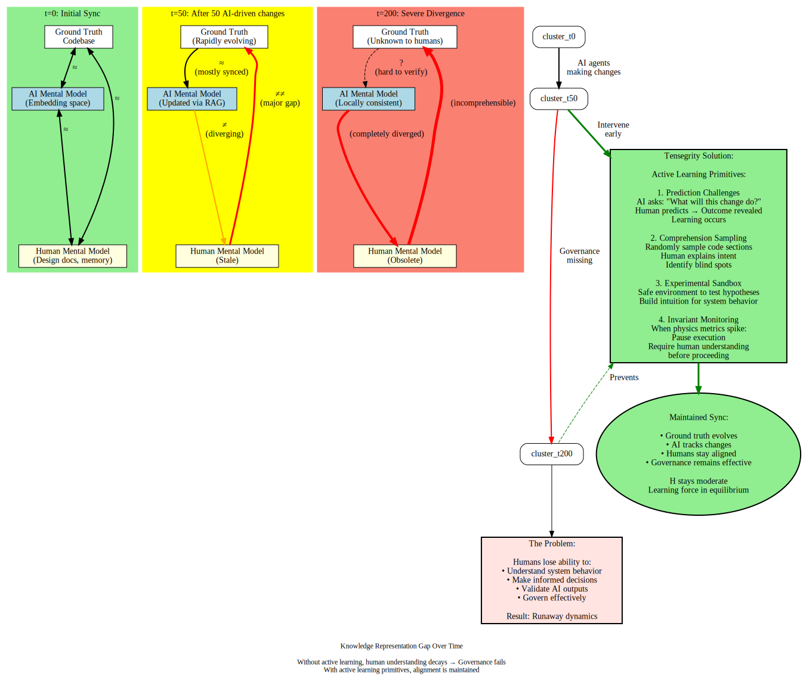

# Software Physics: Motivation and Core Insight

## The Problem We're Solving

When AI agents can write code 10-100x faster than humans, we face a fundamental challenge: **how do we maintain stable, coherent codebases when change velocity accelerates dramatically?**

Traditional metrics like churn, coverage, and incident rates are **lagging indicators**. By the time they show problems, the system is already in crisis. We need a framework that:

1. **Predicts problems before they manifest** as bugs or incidents
2. **Provides structural understanding** of how stress propagates through a codebase
3. **Guides governance decisions** with principled rather than ad-hoc rules
4. **Captures the dynamics** of human-agent-code interaction

## The Central Observation: Software is a Physical Structure

The key insight is that software systems behave like **graph-based physical structures under tension**—specifically, like **tensegrity structures** where:

- **Compression elements** (rigid struts): Code modules, services, infrastructure bearing load
- **Tension elements** (flexible cables): Tests, contracts, architectural boundaries, type systems
- **Forces**: Business requirements, user demand, technical debt, agent-driven changes
- **Stress distribution**: Via the graph structure—neighbors under different strain create tension

This isn't just metaphor. The mathematics of spring networks, electrical circuits, and random walks on graphs all reduce to **the same fundamental object**: the graph Laplacian and its quadratic energy form.

## Why This Matters

### The "Two-Brain Drift" Problem

You described observing a critical phenomenon: when agents operate at high velocity, there's a **phase-locking problem** between two oscillators:

1. **The human mental model** (design world, intentions, architectural understanding)
2. **The actual codebase** (implementation world, as modified by agents)

When these oscillators drift out of phase—when their natural frequencies diverge too much—no reasonable coupling strength will keep them synchronized. This is **textbook synchronization theory** from dynamical systems.

*The diagram above shows how the knowledge representation gap grows over time when AI agents evolve the codebase faster than humans can track. Tensegrity's active learning primitives keep these representations aligned. See also: [../../docs/design/vision_architecture.md](../../docs/design/vision_architecture.md#active-learning-primitives).*

### Current Approaches Fall Short

Existing metrics and tools treat symptoms, not structure:

- **Churn metrics**: Tell you "lots changed" but not where stress concentrated
- **Coverage stats**: Measure test existence but not constraint effectiveness
- **Incident counts**: Lag indicators—problems already manifest
- **Dependency graphs**: Show topology but not tension or energy

What's missing is a **structural mechanics** view: How does stress distribute? Where are the weak points? What's the total "load" on the system?

## The Core Hypothesis

> **Structural tension at graph hubs, measured via Laplacian-based energy, provides earlier warning signals for system instability than traditional per-node metrics alone.**

More formally:

If you model a codebase as a weighted graph where:
- Nodes = modules/services with health, complexity, risk fields
- Edges = dependencies with coupling strength weights
- Dirichlet energy = ½ Σ w_ij (field[i] - field[j])²

Then:

**High local Dirichlet energy at high-centrality nodes predicts future incidents better than global averages of per-node metrics.**

Why? Because the Dirichlet energy captures **gradients**—steep differences between neighbors. A clean module tightly coupled to a mess creates tension in the structure. That tension is where failures nucleate.

## What This Enables

### 1. Early Warning Signals

Instead of waiting for bugs or incidents, monitor:
- Local Dirichlet energy at hubs (are core services under stress?)
- Global Hamiltonian H = T + V (is total "crisis energy" rising?)
- Ratio T/V (are we in chaotic thrash or frozen bureaucracy?)

### 2. Principled Governance

Design rules based on dynamics:
- "No large changes when local V_struct exceeds threshold at hubs"
- "Require refactor when gradient of badness is too steep"
- "Agent-generated change rate limited by structural capacity to absorb it"

Not arbitrary. Grounded in keeping the system in a stable basin of attraction.

### 3. Agent Behavior Shaping

Instead of micromanaging agents, shape the **energy landscape** they operate in:

- Define vector fields (flow[i]) that combine business pressure and energy gradients
- Agents follow local flow, staying "downhill" toward lower energy states
- System automatically steers agents toward actions that reduce structural tension

This is more robust than rule-based systems because it adapts as the structure evolves.

### 4. Phase-Space Trajectories

Track not just state but **trajectories** through (H, complexity, coupling) space:

- Good development: H spikes temporarily then relaxes (controlled change)
- Bad development: H climbs monotonically (runaway complexity)
- Frozen: H high, T low (lots of constraint, no motion—bureaucracy)
- Chaotic: H high, T high (lots of motion, structure stressed—thrash)

*The diagram above maps the T vs V phase space into four regimes, each requiring different governance interventions. Understanding which regime your system is in guides which actions to take.*

These are **qualitatively different regimes** you can see and steer away from.

## The Tensegrity Connection

Your project is called "Tensegrity" for exactly this reason: stability emerges from **balanced opposing forces**, not rigid central control.

In physical tensegrity:
- Isolated compression members (struts) push outward
- Continuous tension network (cables) pulls inward
- Stability from force balance, not rigidity
- Resilient: if one cable breaks, others compensate
- Adjustable: change tension to reshape while maintaining stability

In software tensegrity:
- Code modules under compression (bearing load)
- Constraints under tension (tests, contracts, standards)
- Stability from force balance between velocity, quality, coherence, learning, scope
- Resilient: localized failures don't cascade
- Adjustable: humans tune force intensities for context

The Laplacian-based energy framework **operationalizes** the tensegrity metaphor. It's no longer just vibes—you have actual math for "structural tension", "force distribution", and "energy landscapes".

## What Makes This Different

### Not Just Metrics

Traditional software metrics are scalar: lines of code, cyclomatic complexity, coverage percentage. They don't capture **relationships** or **gradients**.

Graph-based energy captures:
- **Topology**: How modules are wired together
- **Coupling strength**: How tightly bound neighbors are
- **Field gradients**: Steep differences in health/complexity/risk between neighbors
- **Dynamics**: How these change over time

### Not Just Static Analysis

Static analysis finds local issues (this function is complex, this module has no tests).

Structural mechanics finds **stress concentrations**: places where local badness creates tension in the larger structure, making remote parts of the system vulnerable.

### Not Just Dependency Graphs

Dependency graphs show "A depends on B". They don't show:
- **How much** tension is in that dependency (is it fragile? mission-critical?)
- **Gradient across** the dependency (are they both clean, or is one a mess?)
- **Energy cost** of changes propagating along that edge

The Laplacian formulation adds all of this.

## Validation Strategy

To validate this framework, we need to show:

1. **Historical validation**: In past projects, did local Dirichlet energy at hubs spike before major incidents?
2. **Predictive power**: Can we forecast incident risk better than baseline metrics?
3. **Governance utility**: Do policies based on this framework (e.g., gating on local V_struct) improve outcomes?
4. **Toy model sanity**: In a controlled simulator, do the dynamics behave as expected?

The MVP simulator (detailed in separate doc) targets #4: build a toy universe where we can inject shocks, try governance strategies, and watch trajectories in phase space.

If the toy shows non-trivial, reproducible insights—e.g., "tension at hubs is an early warning signal when demand shifts"—then we have structural validity. Then we build toward real-world validation.

## Connection to Your Broader Vision

This "software physics" framework is **theoretical underpinning** for the Tensegrity governance layer you're building.

**Tensegrity (the product)** provides:
- Active learning primitives (prediction challenges, comprehension sampling)
- Equilibrium monitoring (velocity, quality, coherence, learning forces)
- Governance gates (invariant enforcement, architectural rules)

**Software physics (this research)** provides:
- Mathematical vocabulary for "equilibrium", "stress", "stability"
- Diagnostic metrics (H, V, T, local Dirichlet energy)
- Design principles for gates (based on keeping system in viable basin)
- Simulation tools for testing governance strategies

Think of it as:
- **Tensegrity** = the engineered system users interact with
- **Software physics** = the scientific foundation that makes it rigorous

## Why Now?

You have a unique convergence:

1. **Problem is real**: Early adopters using AI agents at scale are hitting coordination chaos and knowledge divergence **today**
2. **Theory is ripe**: Graph spectral methods, dynamical systems, complex adaptive systems are mature fields
3. **Compute is available**: Stargate-scale infrastructure coming online in 12-18 months will 10x agent velocity
4. **No one else is connecting the dots**: Multi-agent frameworks exist, governance tools exist, but no one is grounding them in structural mechanics

You're positioning at the intersection of:
- Software engineering (the domain)
- Dynamical systems (the mathematics)
- Cybernetics/control theory (the design principles)
- Human learning science (the epistemological layer)

## Next Steps

The following documents in this research series will:

1. **Mathematical Foundations**: Graph Laplacians, Dirichlet energy, spectral methods
2. **Software as Physics**: Detailed mapping from software concepts to physical analogues
3. **Tensegrity and Dynamics**: Forces, fields, actors, event-driven simulation
4. **Thermodynamics and Efficiency**: Heat engines, entropy, transducers, efficiency metrics
5. **MVP Simulator Design**: Concrete implementation plan for toy model
6. **Future Directions**: Alternative lenses (cybernetics, active inference, game theory), open questions

Each builds on the previous, creating a coherent theoretical foundation for software physics.

---

**Key Takeaway**: Treating software as a physical structure under tension—with rigorous mathematics via graph Laplacians—gives us earlier warnings, principled governance, and a path to stability at agent scale. This is not metaphor; it's applied mathematics from established fields, adapted to the socio-technical domain of software development.
