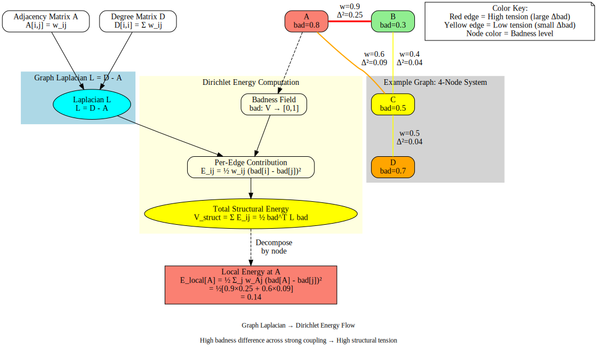

# Mathematical Foundations: Graph Laplacians and Physical Systems

## The Unifying Mathematical Object

At the core of software physics is a single mathematical structure that appears across seemingly disparate domains:

**The graph Laplacian and its associated quadratic energy form.**

This shows up in:
- **Spring networks** (mechanical energy)
- **Electrical circuits** (power dissipation)
- **Random walks** (diffusion and mixing)
- **Spectral clustering** (finding natural boundaries)
- **Heat flow** (temperature equilibration)

The reason: they're all manifestations of the same underlying geometry—a graph with edge weights and functions defined on its nodes.

## Definitions: Building Blocks

### The Graph

Given a weighted undirected graph G = (V, E, w):
- **V**: Set of vertices (nodes)
- **E**: Set of edges
- **w**: Edge weight function, w_ij ≥ 0 for edge (i,j)

In software: nodes are modules/services, edges are dependencies, weights are coupling strength.

### The Laplacian Matrix

The **combinatorial graph Laplacian** is:

```
L = D - A
```

Where:
- **D**: Degree matrix (diagonal), D_ii = Σ_j w_ij
- **A**: Adjacency matrix (weighted), A_ij = w_ij if (i,j) ∈ E, else 0

**Properties**:
- Symmetric and positive semidefinite
- Row sums are zero: L · 1 = 0 (where 1 is all-ones vector)
- Smallest eigenvalue is 0 (with eigenvector 1)
- Number of zero eigenvalues = number of connected components
- Eigenvalues encode graph structure and connectivity

### The Dirichlet Energy

Given a scalar function f: V → ℝ defined on nodes, the **Dirichlet energy** is:

```
E[f] = ½ Σ_(i,j)∈E w_ij · (f(i) - f(j))²
```

In matrix form:
```
E[f] = ½ f^T L f
```

**Interpretation**:
- Measures "roughness" of f over the graph
- High when neighbors disagree strongly
- Zero only if f is constant across connected components
- Quadratic form—determines local minima and optimization landscapes

This is the **fundamental energy** from which everything else derives.



*The diagram above shows a concrete example: a 4-node graph with badness values, how the Laplacian is computed (L = D - A), and how Dirichlet energy flows from per-edge contributions to total structural energy. See [03-software-as-physics-mapping.md](03-software-as-physics-mapping.md) for worked examples with actual code.*

## Physical Incarnations

### Spring Networks

Consider masses at graph nodes with positions x_i ∈ ℝ^d, connected by springs with stiffness k_ij on edges.

**Potential energy** (elastic):
```
V(x) = ½ Σ_(i,j) k_ij · ||x_i - x_j||²
```

For scalar displacements (1D), this is exactly the Dirichlet energy with w_ij = k_ij.

If masses m_i are attached and the system oscillates:

**Kinetic energy**:
```
T(ẋ) = ½ Σ_i m_i · ||ẋ_i||²
```

**Lagrangian**:
```
L = T - V = ½ ẋ^T M ẋ - ½ x^T L x
```

Where M is diagonal mass matrix.

**Equations of motion** (Euler-Lagrange):
```
M ẍ = -L x
```

Or: `ẍ = -M^(-1) L x`

This is a system of coupled harmonic oscillators. **Normal modes** are eigenvectors of L, eigenvalues λ give squared frequencies ω² = λ/m.

### Electrical Networks (Resistor Circuits)

For a resistor network with conductances c_ij on edges and voltages u_i at nodes:

**Power dissipation**:
```
P(u) = ½ Σ_(i,j) c_ij · (u(i) - u(j))²
```

Again, Dirichlet energy with w_ij = c_ij.

**Kirchhoff's current law**: Current into node i is zero (for interior nodes):
```
Σ_j c_ij (u_i - u_j) = 0
```

In matrix form: `L u = 0` at interior nodes.

**Thomson's principle**: The actual voltages in a resistor network minimize power dissipation subject to fixed boundary potentials.

**Effective resistance**: The resistance between nodes i and j is:
```
R_eff(i,j) = (e_i - e_j)^T L^+ (e_i - e_j)
```

Where L^+ is the Moore-Penrose pseudoinverse of L, and e_i is the i-th standard basis vector.

**Key insight**: Effective resistance controls how "far apart" two nodes are electrically—high resistance means weak coupling, low resistance means strong coupling. This generalizes to software: effective resistance between modules measures how isolated vs. entangled they are.

### Random Walks

For a simple random walk on an undirected weighted graph, the transition probability from i to j is:
```
p_ij = w_ij / d_i
```

Where d_i = Σ_j w_ij is the degree.

The **normalized Laplacian** is:
```
L_norm = I - D^(-1/2) A D^(-1/2)
```

The **Dirichlet form** for the random walk:
```
E(f) = ½ Σ_(i,j) π_i p_ij (f(i) - f(j))²
```

Where π is the stationary distribution (π_i ∝ d_i for undirected graphs).

**Commute time** between nodes i and j (expected number of steps to go from i to j and back):
```
C(i,j) = vol(G) · R_eff(i,j)
```

Where vol(G) = Σ_i d_i is the volume of the graph.

**Connection to software**: If you model code exploration as a random walk (following dependencies), commute time tells you how "far" two modules are in terms of navigation. Effective resistance is the same quantity that appears in the electrical analogy.

## Kirchhoff's Matrix-Tree Theorem

A beautiful combinatorial result: **Any cofactor of the Laplacian L equals the number of spanning trees of G**.

Formally, if L_ij is the matrix with row i and column j deleted:
```
det(L_ij) = number of spanning trees
```

**Interpretation**: The Laplacian encodes not just local connectivity but global structural redundancy—how many ways can you wire up the graph minimally? In software, this relates to architectural flexibility: many spanning trees = many valid minimal dependency structures.

## Spectral Properties and Clustering

The eigenvalues {λ_0, λ_1, ..., λ_(n-1)} of L (ordered 0 = λ_0 ≤ λ_1 ≤ ...) encode connectivity:

- **λ_0 = 0 always**, with eigenvector 1 (constant function)
- **λ_1 > 0** iff graph is connected
- **λ_1** (the "algebraic connectivity" or Fiedler value) measures how well-connected the graph is
- Small λ_1 → easy to cut into disconnected pieces (bottleneck exists)
- Large λ_1 → highly connected, hard to partition

The **Fiedler vector** (eigenvector for λ_1) is used for spectral bisection: sign of entries tells you which side of a natural cut each node belongs to.

**For software**: Spectral clustering on the dependency graph reveals natural module boundaries. If you treat the code graph's Laplacian eigenvectors as "vibration modes", the first non-trivial mode shows you "front-end vs. back-end" or "core vs. periphery" splits.

## Harmonic Functions and Minimizers

A function f is **harmonic** at node i if:
```
(L f)_i = 0
```

Equivalently: f(i) is the weighted average of its neighbors.

**Variational principle**: Among all functions with fixed boundary values, the harmonic function minimizes the Dirichlet energy.

**Software interpretation**: If you pin certain modules' "risk" or "complexity" to fixed values (boundary conditions), the natural equilibrium state—where stress is distributed smoothly—is the harmonic extension of those boundary values. The Laplacian tells you how it should diffuse.

## Why the Same Math Everywhere?

All these systems—springs, resistors, random walks, heat flow—share a common structure:

1. **Nodes with states** (positions, voltages, temperatures, probabilities)
2. **Edges with weights** (stiffness, conductance, transition rates, thermal conductivity)
3. **Quadratic energy** penalizing differences across edges
4. **Minimization or equilibration** driving the system toward states that minimize that energy (or satisfy L f = 0)

The Laplacian is the **discrete analogue of the continuous Laplace operator Δ** from PDEs, which governs diffusion, electrostatics, and vibrations in continuum mechanics.

## From Physics to Software

### The Mapping

| Physical System | Software Analogue |
|----------------|------------------|
| Nodes | Modules, services, features |
| Edges | Dependencies, calls, data flows |
| Edge weights w_ij | Coupling strength (how tightly bound) |
| Scalar field f[i] | Health, complexity, risk, "badness" |
| Dirichlet energy E[f] | Structural tension (neighbors disagree) |
| Harmonic function | "Natural" smooth distribution of stress |
| Effective resistance | Isolation / modularity between components |
| Spectral modes | Architectural decomposition patterns |
| Commute time | Navigational distance in codebase |

### Defining Software Potential Energy

Given scalar fields health[i], complexity[i], risk[i], demand[i] on modules, we construct a composite "badness" field:

```
bad[i] = α(1 - health[i]) + β·complexity[i] + γ·risk[i]
```

Then define:

**Structural potential** (tension in the graph):
```
V_struct = ½ Σ_(i,j) w_ij (bad[i] - bad[j])²
          = ½ bad^T L bad
```

High V_struct → neighbors wildly different in badness → tension in structure.

**Business potential** (misalignment with demand):
```
V_bus = Σ_i demand[i] · [λ₁(1 - health[i]) + λ₂·complexity[i]]
```

High-demand modules that are unhealthy or complex contribute heavily.

**Total potential**:
```
V = V_struct + V_bus
```

This V plays the role of potential energy in the Lagrangian formulation.

### Defining Software Kinetic Energy

Over discrete time steps, measure rate of change:

```
Δbad[i]_k = bad[i]_k - bad[i]_(k-1)
T_k = ½ Σ_i m_i (Δbad[i]_k)²
```

Where m_i is "mass" (importance weight, e.g., based on user impact).

Large, rapid changes in critical modules → high T.

### Lagrangian and Hamiltonian

```
L = T - V    (Lagrangian: motion minus potential)
H = T + V    (Hamiltonian: total "stress energy")
```

**Regimes**:
- **Healthy flow**: T and V moderate, roughly balanced, H in comfortable range
- **Frozen**: T ≈ 0, V high → no motion, lots of structural stress (bureaucracy)
- **Chaotic thrash**: T high, V high → rapid motion, structure stressed (instability)

### Gradients and Forces

The discrete gradient of V with respect to bad at node i:

```
∂V/∂bad[i] ≈ (L · bad)[i] = Σ_j w_ij (bad[i] - bad[j])
```

This is the "force" pushing node i to reduce its contribution to the energy.

In the mass-spring analogy, this is literally the spring force. For software, it tells you: **refactoring at node i will reduce V most if (L · bad)[i] is large and positive.**

## Why This Math Gives Us Leverage

### 1. It's Predictive, Not Just Descriptive

Traditional metrics say "module X has high complexity." The Laplacian view says "module X has high complexity AND is tightly coupled to low-complexity neighbors, creating tension that will propagate failures."

The latter is actionable: you know where the weak points are structurally, not just locally.

### 2. It's Compositional

You can compute local contributions to global quantities. For example:

```
V_struct = Σ_(i,j) ½ w_ij (bad[i] - bad[j])²
```

Sum over all edges. You can aggregate this by:
- **Per-node**: How much tension does each module contribute?
- **Per-edge**: Which dependencies are most stressed?
- **Per-subsystem**: What's the internal tension in service A vs. service B?

This enables **drill-down analysis**: start at global H, zoom into which subsystems are hot, zoom further into which edges are strained.

### 3. It's Tunable

Edge weights w_ij encode coupling strength. If you:
- **Refactor to decouple**: Reduce w_ij
- **Add integration tests**: Effectively increase "constraint stiffness" (tighter coupling in test space)
- **Split a monolith**: Replace one high-degree node with several lower-degree nodes, reducing centrality

Each of these changes the Laplacian, hence the energy landscape, hence the dynamics.

You can simulate governance policies by tweaking weights and watching how H evolves.

### 4. It Connects to Well-Understood Tools

- **PageRank**: Related to the stationary distribution of a random walk, which is tied to the Laplacian
- **Betweenness centrality**: Related to current flow and effective resistance
- **Community detection**: Spectral clustering using Laplacian eigenvectors
- **Graph neural networks**: Often use Laplacian-based convolutions

Software physics isn't inventing new math; it's applying established graph theory and spectral methods to a new domain (socio-technical systems).

## Intuition: Why Laplacians Capture "Stress"

Think of the graph as a network of springs. Each edge is a spring that wants its endpoints to have similar values. If they differ, the spring is stretched, storing energy proportional to (difference)².

The Laplacian is the operator that measures **total stored energy** across all springs. Minimizing the Dirichlet energy is like letting the spring network relax to equilibrium.

When you force certain nodes to have specific values (boundary conditions), the rest of the graph adjusts to minimize global tension. The resulting configuration is the **harmonic function**—the "path of least resistance" for stress to distribute.

In software:
- **Business requirements** = boundary conditions (these modules MUST have certain properties)
- **Structural constraints** = springs (tests, contracts, architectural rules)
- **Equilibrium state** = harmonic extension (how should complexity/risk naturally distribute given constraints?)

When you observe high Dirichlet energy, it means the system is **not at equilibrium**: there are sharp gradients, mismatches, stress concentrations. Those are where failures will nucleate.

## Connection to Continuous Systems

The graph Laplacian is the discrete analogue of the continuous Laplace operator:

```
Δu = ∂²u/∂x² + ∂²u/∂y² + ∂²u/∂z²
```

Which appears in:
- **Heat equation**: ∂u/∂t = κ Δu (temperature diffusion)
- **Wave equation**: ∂²u/∂t² = c² Δu (vibrations)
- **Poisson equation**: Δu = f (electrostatics, gravity)

The finite-element method for solving these PDEs discretizes space into a mesh (graph), and the discrete Laplacian matrix is exactly the graph Laplacian.

So when we say "codebase as physical structure", we're importing a century of PDE and numerical analysis intuition into software.

## Summary: The Mathematical Spine

**Core object**: Graph Laplacian L and Dirichlet energy E[f] = ½ f^T L f

**Physical interpretations**:
- Spring network: Elastic potential energy
- Resistor network: Power dissipation, Kirchhoff's laws
- Random walk: Dirichlet form, commute times
- Heat flow: Temperature equilibration

**Software mapping**:
- Nodes = modules; edges = dependencies; weights = coupling
- Fields f = health, complexity, risk, demand
- Dirichlet energy = structural tension (neighbors disagree)
- Potential V = V_struct + V_bus (tension + business misalignment)
- Kinetic T = rate of change of fields
- Hamiltonian H = T + V = total system stress

**Why it works**:
- Captures relationships, not just local properties
- Compositional: local → global aggregation
- Predictive: gradients show where stress concentrates
- Grounded: decades of theory in spectral graph theory, mechanics, circuits

Next: How to use this framework to define forces, fields, and dynamics for software systems, and how it connects to the tensegrity metaphor.
