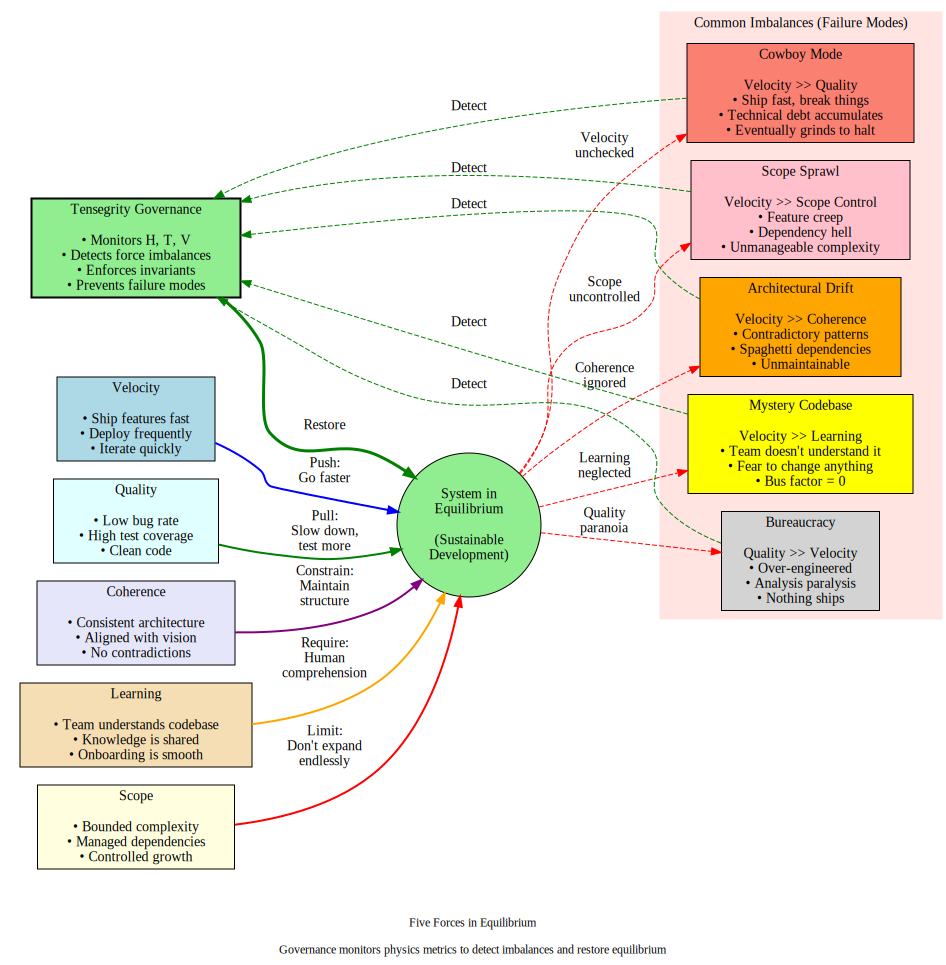
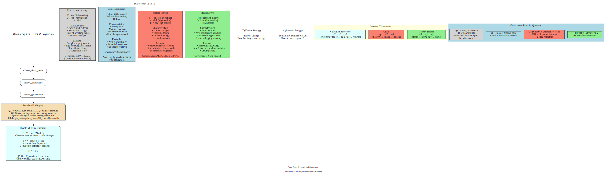

# Tensegrity Structures and Software Dynamics

## Overview

This document connects the **tensegrity structural principle** to software system dynamics, showing how balanced opposing forces create stability, how actors perturb the system, and how governance maintains equilibrium.

**Prerequisites**: Read `01-motivation-and-core-insight.md` and `02-mathematical-foundations.md` for the physics background.

**Builds toward**: The simulation design in `simulation/mvp-*.md` and governance principles in `../docs/design/vision_architecture.md`.

---

## Part 1: What is Tensegrity?

### The Architectural Principle

**Tensegrity** (tensional integrity) is a structural principle where:

1. **Compression elements** (rigid struts) push outward
2. **Tension elements** (flexible cables) pull inward
3. **Stability emerges** from the balance of forces, not rigid connections
4. **Resilience**: If one cable breaks, others compensate; the structure adapts

**Key insight**: The structure is **pre-stressed**. There's always tension, always compression. The forces are in equilibrium, not zero.

### Physical Examples

**Buckminster Fuller's geodesic domes:**
- Struts: Steel or aluminum tubes (compression)
- Cables: Steel wires (tension)
- Loads distribute across the entire structure
- Remove one element → neighbors pick up the slack

**Biological tensegrity:**
- Bones: Compression elements
- Muscles, tendons, fascia: Tension elements
- The skeleton "floats" in a sea of tension
- Posture = force balance, not bone-on-bone stacking

**Key property**: You can't push a rope, you can't pull a strut. The two types of forces are **fundamentally different** but must coexist.

### Why Software as Tensegrity?

In a codebase:

**Compression elements** (bear load, resist collapse):
- Code modules
- Services
- Infrastructure
- Data schemas

**Tension elements** (constrain, prevent fragmentation):
- Tests
- Type systems
- Contracts/interfaces
- Architectural boundaries
- Code review processes

**The forces**:
- **Business pressure** pushes for features (compression - adds mass to structure)
- **Quality constraints** pull back against technical debt (tension - prevents collapse)
- **Architectural coherence** maintains shape (tension - prevents fragmentation)
- **Velocity** drives change (compression - kinetic energy)
- **Learning** keeps human understanding aligned (tension - prevents drift)

**Equilibrium**: When forces balance, the system evolves stably. When imbalanced, we get runaway dynamics or frozen bureaucracy.

---

## Part 2: The Five Forces in Detail

### Force 1: Velocity (Compression - Drives Motion)

**Physical analog**: Applied force, kinetic energy

**Definition**: The rate at which the codebase changes.

**Metrics**:
```python
velocity = completed_tasks_per_day
T_kinetic = 0.5 * Σ_i m_i * (Δbad_i)²  # Change rate energy
```

**Effect on system**:
- **Too low**: Stagnation, no progress, system atrophies
- **Optimal**: Steady evolution, H oscillates gently
- **Too high**: Chaotic thrash, structure can't absorb changes, H climbs

**Who applies it**:
- Product managers (requirements)
- Engineers (implementation velocity)
- AI agents (10-100x human velocity)

**The tension**: Velocity is necessary (no progress without it), but unconstrained velocity **fractures** the structure.

### Force 2: Quality (Tension - Resists Degradation)

**Physical analog**: Elastic restoring force, material strength

**Definition**: Resistance to technical debt accumulation.

**Metrics**:
```python
quality = test_coverage * (1 - bug_density) * code_health
V_quality_penalty = Σ_i (1 - health_i)²  # Cost of poor quality
```

**Effect on system**:
- **Too low**: Technical debt accumulates, system becomes brittle
- **Optimal**: Quality gates catch regressions without blocking flow
- **Too high**: Bureaucracy, nothing ships, paralysis

**Who applies it**:
- QA processes
- Test suites
- Static analysis
- Code review

**The tension**: Quality is necessary (prevents collapse), but excessive quality gates **freeze** the system.

### Force 3: Coherence (Tension - Maintains Shape)

**Physical analog**: Surface tension, boundary conditions

**Definition**: Architectural consistency, the "shape" of the system.

**Metrics**:
```python
coherence = 1 / (architectural_violations + pattern_inconsistencies)
V_struct = 0.5 * Σ_(i,j) w_ij (bad_i - bad_j)²  # Structural tension
```

**Effect on system**:
- **Too low**: Architectural drift, spaghetti code, fragmentation
- **Optimal**: Consistent patterns, clear boundaries, easy to navigate
- **Too high**: Over-architected, rigid, can't adapt to new requirements

**Who applies it**:
- Architects
- Design reviews
- Linters enforcing patterns
- API contracts

**The tension**: Coherence enables scaling (consistency), but excessive coherence **prevents** evolution.

### Force 4: Learning (Tension - Synchronizes Mental Models)

**Physical analog**: Phase-locking, synchronization, feedback control

**Definition**: The rate at which human understanding keeps pace with codebase evolution.

**Metrics**:
```python
knowledge_gap = divergence(human_model, ground_truth)
learning_force = -∇(knowledge_gap)  # Pull toward alignment
```

**Effect on system**:
- **Too low**: Knowledge divergence, humans can't govern what they don't understand
- **Optimal**: Active learning keeps mental models aligned
- **Too high**: Over-documentation, spending all time teaching instead of building

**Who applies it**:
- Code review (passive learning)
- Active learning primitives (prediction challenges, comprehension sampling)
- Pair programming
- Documentation

**The NEW bottleneck**: At agent velocity (10-100x), learning becomes the constraint. This is the **novel force** that didn't exist at human-scale development.

### Force 5: Scope (Compression/Tension - Defines Boundaries)

**Physical analog**: Boundary conditions, system size

**Definition**: What's in vs. out of scope, feature bloat vs. focus.

**Metrics**:
```python
scope = number_of_modules + number_of_features + dependency_count
V_scope = λ * scope²  # Quadratic cost of complexity
```

**Effect on system**:
- **Too low**: Under-featured, doesn't solve the problem
- **Optimal**: Bounded complexity, manageable surface area
- **Too high**: Feature creep, dependency hell, unmaintainable

**Who applies it**:
- Product strategy
- Deprecation policies
- Dependency pruning

**The tension**: Scope must grow to add value, but unconstrained growth makes the system **incomprehensible**.

---

## Part 3: Equilibrium as Force Balance

### The Central Equation

The system is in **equilibrium** when:

```
F_velocity + F_quality + F_coherence + F_learning + F_scope ≈ 0
```

Not literally zero (that's death), but **balanced oscillation** around a stable point.

**In Hamiltonian terms**:

```
H = T + V
H = T_velocity + V_quality + V_coherence + V_learning + V_scope

Equilibrium: H oscillates gently, mean is moderate
Crisis: H climbs monotonically (runaway)
Stagnation: H frozen at high V, low T (bureaucracy)
```

### Visualizing the Force Balance



**Healthy equilibrium**:
- Velocity pushes for features
- Quality/Coherence/Learning pull back
- Scope stays bounded
- H = moderate, gentle oscillations

**Failure modes** (force imbalances):

1. **Cowboy Mode**: Velocity >> Quality
   - Ship fast, break things
   - Technical debt accumulates
   - H climbs until incidents force slowdown

2. **Bureaucracy**: Quality >> Velocity
   - Over-engineered, analysis paralysis
   - Nothing ships, innovation dies
   - H high but frozen (all potential, no kinetic)

3. **Architectural Drift**: Velocity >> Coherence
   - Patterns inconsistent
   - Spaghetti dependencies
   - V_struct climbs (neighbor disagreement)

4. **Mystery Codebase**: Velocity >> Learning
   - Humans don't understand what was built
   - Can't make good decisions
   - Knowledge gap → governance failure

5. **Scope Sprawl**: Velocity >> Scope Control
   - Feature creep
   - Dependency hell
   - System becomes unmaintainable

**Governance role**: Detect which forces are out of balance, adjust the "cable tensions" to restore equilibrium.

---

## Part 4: Actors as Perturbations

### Actors Inject Energy

In the simulation framework (see `simulation/mvp-simulation-design.md`), **actors** are entities that perturb the system by firing events.

**Three actor types**:

1. **FeatureEngineer**: Applies velocity force
   - Increases complexity
   - Adds features
   - Driven by business demand

2. **RefactorEngineer**: Applies quality force
   - Reduces complexity
   - Improves health
   - Driven by structural tension (∇V)

3. **AIAgent**: Follows flow field blindly
   - No strategic thinking
   - High velocity, mixed quality
   - Can apply either force depending on local gradient

### Events as Force Applications

Each event is a **delta function** - a sudden injection or extraction of energy.

**FeatureChange(i)**: Increases complexity, decreases health
```python
complexity[i] += 0.1
health[i] -= 0.05
# Effect: Increases V (more badness), increases T (change happened)
```

**Refactor(i)**: Decreases complexity, increases health
```python
complexity[i] -= 0.1
health[i] += 0.08
# Effect: Decreases V (less badness), increases T (change happened)
```

**DemandShock(i, Δ)**: External force (market, competitor)
```python
demand[i] += Δ
# Effect: Changes V_bus, rotates flow field
```

### The Flow Field: Guiding Actors

Actors don't choose randomly. They follow a **vector field** that encodes:

```python
flow[i] = (business_direction, stability_direction)

business_direction = demand[i] / max_demand  # Normalized 0-1
stability_direction = -grad_V[i] / max_grad  # Downhill in energy

# Different actors weight these differently:
fe_action = 0.8 * business + 0.2 * stability  # FeatureEngineer
re_action = 0.2 * business + 0.8 * stability  # RefactorEngineer
ai_action = 0.6 * business + 0.4 * stability  # AIAgent
```

**Physical analog**: The flow field is like an **electromagnetic field** guiding charged particles. Actors have different "charges" (priorities), so they respond differently to the same field.

---

## Part 5: Governance as Active Control

### The Problem: Uncontrolled Dynamics

Without governance, actors follow local gradients. This can lead to:

**Runaway velocity**: AI agents ship features faster than structure can absorb
- H climbs monotonically
- V_struct increases (mismatched health between coupled modules)
- Eventually: incidents, outages, forced halt

**Frozen bureaucracy**: Quality constraints so strict nothing moves
- H high but static
- T → 0 (no change)
- Innovation dies

### The Solution: Dynamic Governance Rules

Governance **adjusts the forces** based on system state.

**Rule 1: Emergency brake** (prevent runaway)
```python
if H > H_critical:
    # System in crisis, reduce velocity force
    block_feature_work()
    require_refactors()
    # Force T down, allow V to relax
```

**Rule 2: Local energy gate** (prevent stress concentration)
```python
if E_local[hub_node] > threshold:
    # Stress concentrating at critical node
    block_changes_to_neighbors(hub_node)
    require_refactor_or_test(hub_node)
    # Reduce V_struct by smoothing the gradient
```

**Rule 3: Knowledge gap alert** (prevent learning divergence)
```python
if knowledge_gap > threshold:
    # Human understanding lagging
    trigger_comprehension_challenge()
    require_prediction_before_approval()
    # Slow velocity until learning catches up
```

**Rule 4: Coherence enforcement** (maintain architectural shape)
```python
if architectural_violations > threshold:
    # Structure fragmenting
    block_changes_that_violate_patterns()
    require_migration_path()
    # Increase coherence force (tension)
```

### Control Theory View

**Governance is a feedback controller**:

```
Sensors: H, T, V, E_local, knowledge_gap, coherence_metrics
Setpoint: H_target (desired equilibrium)
Actuators: Gates, constraints, required refactors
Control law: PID-like adjustments to force "gains"

Error = H - H_target
Control = K_p * error + K_d * dH/dt

If error > 0: Increase quality/coherence forces (pull back on velocity)
If error < 0: Relax constraints (allow more velocity)
```

**This is not arbitrary rules**. It's a **control system** maintaining dynamic equilibrium.

---

## Part 6: Phase Space Trajectories

### State Space Representation

The system's state at time t:

```python
state(t) = {
    G(t): Graph(V, E, w),  # Topology
    fields(t): {health, complexity, risk, demand},  # Scalar fields
    H(t): Total energy,
    T(t): Kinetic energy,
    V(t): Potential energy,
}
```

**Trajectory**: Path through (H, T, V, coherence, knowledge_gap, ...) space over time.

### Regime Classification



**Quadrant 1: Healthy Flow** (T high, V low)
- Lots of change, low tension
- Features shipping, structure healthy
- **Trajectory**: Oscillates around low H

**Quadrant 2: Chaotic Thrash** (T high, V high)
- Lots of change, high tension
- Breaking things, stressed modules
- **Trajectory**: H climbing (crisis)

**Quadrant 3: Stable Equilibrium** (T low, V low)
- Little change, low tension
- Maintenance mode, mature system
- **Trajectory**: H low and flat

**Quadrant 4: Frozen Bureaucracy** (T low, V high)
- Little change, high tension
- Constrained, can't move
- **Trajectory**: H high but flat

### Detecting Regime Transitions

**Early warning signals** before crisis:

1. **Rising H**: Total energy climbing
2. **High T/V ratio**: Lots of motion relative to structure
3. **E_local spike at hubs**: Stress concentrating
4. **Increasing ∇V**: Steeper badness gradients
5. **Knowledge gap widening**: Human understanding lagging

**Governance responds**:
- Detect regime via (T, V) coordinates
- Apply regime-specific control rules
- Steer trajectory back toward healthy region

---

## Part 7: Worked Example - Competitor Shock Scenario

### Initial State (t=0)

**System**: 6-node graph, healthy equilibrium

```
Modules: A (core), B (API), C (feature), D (feature), E (data), F (infra)
Health: all ~0.7-0.8
Complexity: all ~0.3-0.4
Demand: uniform ~0.5
H₀ = 0.8 (moderate)
T₀ = 0.05 (low, steady state)
V₀ = 0.75 (moderate structural + business tension)
```

### Event: Competitor Launches Feature (t=20)

**External shock**:
```python
demand[C] -= 0.4  # Users migrating away
demand[G_new] = 0.8  # New feature demand (add node G)
G.add_node('G_new', health=0.5, complexity=0.3, demand=0.8)
G.add_edge('G_new', 'A', weight=0.6)  # Must integrate with core
```

**Immediate effect**:
- V_bus increases (high demand on moderate-health node)
- Flow field rotates toward G_new
- H spikes from 0.8 → 1.2

### Response: Unconstrained Actors (t=21-40)

**Actors follow flow**:
- FeatureEngineers rush to G_new (high demand)
- AIAgents also rush to G_new (high ||flow||)
- RefactorEngineers overwhelmed (only 1 vs. 3 feature actors)

**Dynamics**:
```
t=25: complexity[G_new] → 0.6, health[G_new] → 0.3
      E_local[A] → 0.6 (A now coupled to unhealthy G_new)
      H → 1.8

t=30: A starts degrading (high E_local predicts trouble)
      health[A] → 0.5
      Cascading effect: B, E depend on A
      H → 2.5

t=35: First incident (predicted by E_local at t=25)
      avg(health) → 0.4
      System in crisis
```

**Trajectory**: Quadrant 1 → Quadrant 2 (healthy → chaotic thrash)

### Response: Governed Actors (t=21-40)

**Governance rules active**:

```python
# t=22: E_local[A] = 0.4 (approaching threshold 0.5)
if E_local[A] > 0.4:
    warn("High tension at core module A")
    require_test_before_feature(neighbors_of(A))

# t=24: E_local[A] = 0.52 (exceeded threshold)
if E_local[A] > 0.5:
    block_features_to_neighbors(A)
    require_refactor(A) or require_refactor(G_new)

# t=26: H = 1.5 (approaching critical)
if H > 1.5:
    emergency_brake()
    pause_feature_work()
    require_2x_refactors()

# t=28: Refactors applied to G_new and A
health[G_new] → 0.6
health[A] → 0.7
E_local[A] → 0.3
H → 1.2

# t=30: Constraints relax, flow resumes
H → 1.0 (returned to healthy)
```

**Trajectory**: Brief spike into Quadrant 2, then controlled return to Quadrant 1.

### Comparison: Governed vs. Unconstrained

| Metric | Unconstrained | Governed |
|--------|---------------|----------|
| Peak H | 2.5 (t=30) | 1.5 (t=26) |
| Incidents | 3 (t=35, 38, 42) | 0 |
| Avg health at t=40 | 0.4 | 0.65 |
| Time in crisis | 15 steps | 4 steps |
| E_local warning lead time | - | ~10 steps before incident |

**Key result**: Governed system **absorbs the shock** without collapse. Unconstrained system **cascades into crisis**.

---

## Part 8: Connection to Tensegrity Vision

### From Physics to Product

This mathematical framework provides the **theoretical foundation** for the Tensegrity governance layer described in `../docs/design/vision_architecture.md`.

**Vision document describes WHAT**:
- Enforce invariants
- Monitor equilibrium
- Adjust force tensions
- Active learning primitives

**This document describes HOW** (mathematically):
- Invariants = thresholds on H, E_local, ∇V
- Equilibrium = H oscillating gently, forces balanced
- Force adjustment = changing actor policies, governance rules
- Learning = reducing knowledge_gap via active retrieval

### The Five Forces Map Precisely

| Vision Force | Physics Quantity | Measurement |
|--------------|------------------|-------------|
| Velocity | T = ½ Σ m(Δbad)² | Kinetic energy, change rate |
| Quality | health fields, (1-health)² penalty | Health metrics, test coverage |
| Coherence | V_struct = ½ bad^T L bad | Structural potential energy |
| Learning | knowledge_gap = divergence(human, truth) | Prediction accuracy, comprehension tests |
| Scope | scope count, complexity sum | Module count, dependency depth |

**Not metaphor. Measurable quantities.**

### Active Learning as Phase-Locking

The "two-brain drift" problem (see `01-motivation-and-core-insight.md`) is a **phase synchronization** problem:

**Two oscillators**:
1. Codebase (evolving at agent velocity)
2. Human mental model (updating at human learning rate)

**Without coupling**: Oscillators drift out of phase
- Frequency mismatch: ω_agent = 100 × ω_human
- Phase divergence: Δφ grows linearly with time
- Result: Knowledge gap → governance failure

**With active learning**: Forced synchronization
- Prediction challenges = phase-locking pulses
- Comprehension sampling = periodic phase reset
- Learning gates = reduce ω_agent when Δφ > threshold

**Control theory**: This is a **phase-locked loop (PLL)** maintaining synchronization between two oscillators with different natural frequencies.

---

## Part 9: Limitations and Assumptions

### What This Model Captures Well

1. **Structural tension** via Laplacian energy
2. **Change dynamics** via Hamiltonian framework
3. **Force balance** as governance principle
4. **Early warning signals** from local energy

### What This Model Simplifies

1. **Edge weights are static**: In reality, coupling evolves
2. **Scalar fields**: Health/complexity are multidimensional (test coverage, bug density, cognitive complexity, etc.)
3. **Deterministic events**: Real changes have stochastic outcomes
4. **Single timescale**: Different processes (refactors, features, incidents) happen at different rates
5. **Ignore semantics**: We measure structure, not correctness

### Key Assumptions to Validate

**Hypothesis 1**: High E_local predicts incidents ~10 steps earlier than scalar metrics
- **Test**: Probe #1 on real git history

**Hypothesis 2**: Governed systems recover faster from shocks
- **Test**: Simulation scenarios with/without governance

**Hypothesis 3**: T/V ratio distinguishes regimes
- **Test**: Measure real projects in different states

**Hypothesis 4**: Knowledge gap is measurable and predicts governance failure
- **Test**: Track prediction accuracy vs. system stability

---

## Part 10: Summary - Forces, Equilibrium, Control

### The Tensegrity Principle in Software

1. **Compression forces** (velocity, scope) drive expansion
2. **Tension forces** (quality, coherence, learning) prevent collapse
3. **Equilibrium** emerges from balanced opposition, not absence of force
4. **Resilience** comes from distributed load-bearing, not rigid control
5. **Governance** adjusts force tensions dynamically based on system state

### The Mathematical Tools

- **Graph Laplacian L**: Encodes structure, neighbors, coupling
- **Dirichlet energy V_struct**: Measures structural tension
- **Hamiltonian H = T + V**: Tracks total system stress
- **Phase space (T, V)**: Classifies regimes, detects crises
- **Governance rules**: Thresholds on H, E_local, knowledge_gap

### The Control Loop

```
1. Sense: Measure H, T, V, E_local, knowledge_gap
2. Classify: Which regime? (Healthy, Thrash, Frozen, Stable)
3. Decide: Which forces are imbalanced?
4. Actuate: Adjust governance rules (gates, constraints, priorities)
5. Repeat: Continuous monitoring and adjustment
```

**This is not a static architecture**. It's a **dynamic control system** maintaining equilibrium in a high-velocity environment.

---

## Next Steps

**Read next**: `05-thermodynamics-and-efficiency.md` for the thermodynamic view (entropy, heat engines, Carnot efficiency of development processes).

**Then**: `06-future-directions.md` for alternative models and research questions.

**Finally**: Build the probes. Test the hypotheses. Validate with data.

**The experimentalist's promise**: All of this beautiful theory must now face the crucible of measurement.
