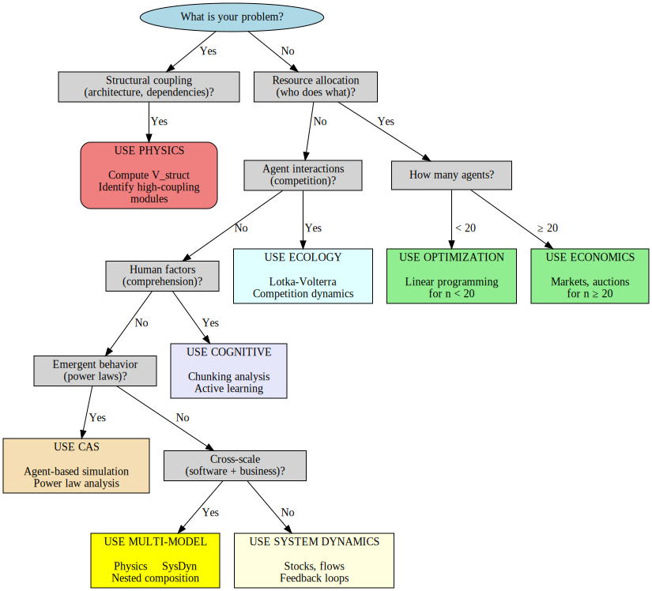

# Decision Guide: Selecting the Right Mental Model

## Overview

**Purpose:** Practical flowchart to select which mental model(s) to use for a given problem.

**Philosophy:** No single model is best for everything. Match model to problem.

**Available models:**
- **Physics** - Tensegrity, Hamiltonian, coupling energy
- **Economics** - Markets, auctions, budgets, mechanism design
- **System Dynamics** - Stocks, flows, feedback loops
- **Cognitive** - Mental models, understanding, learning (from business/ folder)
- **Multi-model** - Combine multiple frameworks

---

## Quick Decision Tree

```
START: What is your primary problem?
  |
  ├─> Predict failures/incidents?
  |    └─> Is it structural (coupling, dependencies)?
  |         ├─ YES → Use Physics
  |         └─ NO → Use System Dynamics (feedback loops)
  |
  ├─> Allocate resources optimally?
  |    └─> How many agents?
  |         ├─ <20 → Use simple optimization (Linear Programming)
  |         └─ >20 → Use Economics (markets/auctions)
  |
  ├─> Understand long-term dynamics?
  |    └─> Single domain (software only)?
  |         ├─ YES → Use Physics
  |         └─ NO (cross-domain) → Use System Dynamics
  |
  ├─> Align human and AI goals?
  |    └─> Use Cognitive + System Dynamics (trust loops)
  |
  ├─> Scale system (10x agents)?
  |    └─> Is bottleneck centralized coordination?
  |         ├─ YES → Use Economics (decentralize)
  |         └─ NO → Use Physics (identify structural bottlenecks)
  |
  └─> Complex, multi-faceted problem?
       └─> Use Multi-model (see integration guide below)
```

### Visual Decision Tree



**Interactive visual guide** for model selection based on problem characteristics (structural vs. resource, small vs. large scale, single vs. cross-domain).

---

## Detailed Decision Framework

### Step 1: Characterize Your Problem

**Answer these questions:**

1. **Domain?**
   - [ ] Software only (codebase, architecture)
   - [ ] Software + business (customers, revenue)
   - [ ] Software + humans (team, understanding)
   - [ ] Software + AI agents
   - [ ] Other: ___________

2. **Time horizon?**
   - [ ] Real-time (seconds)
   - [ ] Short-term (days to weeks)
   - [ ] Medium-term (months)
   - [ ] Long-term (years)

3. **Primary goal?**
   - [ ] Predict (failures, bottlenecks, outcomes)
   - [ ] Optimize (resource allocation, task assignment)
   - [ ] Understand (feedback loops, emergent behavior)
   - [ ] Intervene (refactor, reallocate, change policy)
   - [ ] Align (human-AI, team goals)

4. **Scale?**
   - [ ] Small (<10 agents/modules)
   - [ ] Medium (10-50)
   - [ ] Large (50-100)
   - [ ] Very large (>100)

5. **Constraints?**
   - [ ] Must be simple (non-expert users)
   - [ ] Must be fast (<1 second computation)
   - [ ] Must be measurable (no subjective variables)
   - [ ] Must be general (reuse across projects)

### Step 2: Apply Model Selection Rules

**Rule 1: If domain = software only AND goal = predict failures**
→ **Use Physics**

*Rationale:* Coupling energy (V_struct) strongly predicts structural failures.

*Example:* "Which module will have next incident?"

---

**Rule 2: If scale > 50 AND goal = optimize resources**
→ **Use Economics**

*Rationale:* Markets scale better than central planning or physics models.

*Example:* "Assign 100 tasks to 50 agents optimally"

---

**Rule 3: If domain = cross-domain (software + business) AND goal = understand**
→ **Use System Dynamics**

*Rationale:* Stock-flow models capture feedback across scales.

*Example:* "How does software quality impact business revenue?"

---

**Rule 4: If goal = align AND actors = human + AI**
→ **Use Cognitive + System Dynamics**

*Rationale:* Need mental model theory (Cognitive) + trust feedback loops (System Dynamics).

*Example:* "Why are humans rejecting AI recommendations?"

---

**Rule 5: If constraint = simplicity AND users = non-experts**
→ **Use Economics**

*Rationale:* Markets and prices are universally understood.

*Example:* "Explain coordination to business stakeholders"

---

**Rule 6: If goal = intervene AND problem = technical debt**
→ **Use Physics (diagnosis) + Economics (execution)**

*Rationale:* Physics identifies modules to refactor, Economics allocates budget optimally.

*Example:* "Reduce incidents from 5/week to 1/week"

---

**Rule 7: If time_horizon = long-term (years) AND goal = policy design**
→ **Use System Dynamics**

*Rationale:* Simulate long-term accumulation and feedback.

*Example:* "Should we invest in testing or refactoring over 5 years?"

---

**Rule 8: If none of above apply**
→ **Use Multi-model (see Step 3)**

---

### Step 3: Multi-Model Integration

**When to use multiple models together:**

1. **Problem has multiple facets** (structural + resource + human)
2. **Single model scores < 7 on critical dimension**
3. **High-stakes decision** (worth extra analysis effort)

**Integration strategies:**

#### Strategy A: Sequential (Pipeline)

```
Model 1 → Output → Model 2 → Output → Model 3 → Final recommendation

Example:
  System Dynamics: Diagnose feedback loop (debt → incidents)
       ↓
  Physics: Identify high-debt modules (V_struct)
       ↓
  Economics: Allocate budget for refactoring (auction)
       ↓
  Final: Refactor modules X, Y, Z with budget $B
```

**When to use:** Models have complementary strengths (diagnosis → prescription → execution).

---

#### Strategy B: Parallel (Ensemble)

```
Model 1 ↘
Model 2 → Combine predictions → Final prediction
Model 3 ↗

Example (Incident Prediction):
  Physics: Module A risk = 0.85
  Economics: Module A risk = 0.65
  System Dynamics: Module A risk = 0.72
       ↓
  Ensemble (average): 0.74
  Ensemble (weighted): 0.80 (weight physics higher for structural problems)
```

**When to use:** Multiple models make similar predictions, ensemble reduces variance.

---

#### Strategy C: Hierarchical (Nested)

```
Outer model (macro):
  ├─ Inner model 1 (micro)
  ├─ Inner model 2 (micro)
  └─ Inner model 3 (micro)

Example:
  System Dynamics (business level):
    Software quality → Decision quality → Revenue
       ↓ (nested within)
    Physics (software level):
       V_struct → Incidents → Quality drops
```

**When to use:** Cross-scale problems (software within business, agents within team).

---

### Step 4: Validate Model Choice

**Before committing, check:**

1. **Can we measure model's variables?**
   - If not → pick more measurable model

2. **Can team learn model in available time?**
   - Learning curve < project timeline?

3. **Does model's computational cost fit constraints?**
   - Real-time decision → need <1s runtime

4. **Has model been validated in similar context?**
   - Check benchmark scenarios (from `02-benchmark-scenarios.md`)

5. **What's the downside if model is wrong?**
   - High stakes → use ensemble or validate heavily
   - Low stakes → single model OK

---

## Decision Matrix

**Use this table to narrow down options:**

| Your Requirement | Physics | Economics | System Dynamics | Cognitive |
|------------------|---------|-----------|-----------------|-----------|
| Predict incidents | ✓✓✓ (8) | ✓ (6) | ✓✓ (7) | ✗ (3) |
| Allocate resources | ✓ (5) | ✓✓✓ (9) | ✓ (4) | ✗ (2) |
| Understand feedback | ✓ (6) | ✓ (5) | ✓✓✓ (8) | ✓✓ (7) |
| Simple/intuitive | ✗ (5) | ✓✓✓ (8) | ✓ (6) | ✓✓ (7) |
| Scales to 100+ agents | ✓✓ (9) | ✓✓✓ (10) | ✓ (7) | ✗ (4) |
| Fast computation | ✓✓ (8) | ✓✓✓ (10) | ✓ (5) | ✓✓ (7) |
| Measurable variables | ✓✓ (7) | ✓✓✓ (9) | ✓ (5) | ✗ (3) |
| General (many contexts) | ✓✓ (7) | ✓✓ (7) | ✓✓✓ (8) | ✓ (6) |

**Legend:**
- ✓✓✓ = Excellent (score 8-10)
- ✓✓ = Good (score 6-7)
- ✓ = Acceptable (score 4-5)
- ✗ = Poor (score 0-3)
- (Number) = Actual score from evaluation

---

## Example Walkthroughs

### Example 1: "System is having too many incidents"

**Step 1: Characterize**
- Domain: Software only
- Time horizon: Short-term (fix in 4 weeks)
- Primary goal: Predict which modules will fail, then fix
- Scale: Medium (30 modules)
- Constraints: Need concrete recommendations

**Step 2: Apply rules**
- Rule 1 applies: Domain = software, goal = predict failures → **Physics**

**Step 3: Validate**
- ✓ Can measure V_struct from code graph
- ✓ Team can learn in 2 weeks (have 4 weeks)
- ✓ Fast computation (5 seconds)
- ✓ Validated on Scenario 1 (AUC = 0.82)

**Decision: Use Physics**

**Action:**
1. Compute coupling energy for all modules
2. Rank by V_struct (highest first)
3. Refactor top 3 high-coupling modules
4. Expected: 60-70% incident reduction

---

### Example 2: "Need to assign 100 tasks to 40 AI agents"

**Step 1: Characterize**
- Domain: Software + AI agents
- Time horizon: Real-time (assign within seconds)
- Primary goal: Optimize allocation
- Scale: Large (100 tasks, 40 agents)
- Constraints: Must be fast, scalable

**Step 2: Apply rules**
- Rule 2 applies: Scale > 50, goal = optimize → **Economics**

**Step 3: Validate**
- ✓ Can measure budgets, prices (directly observable)
- ✓ Team can learn auctions quickly (6 hours)
- ✓ Very fast computation (0.5 seconds)
- ✓ Validated on Scenario 2 (96% efficiency)

**Decision: Use Economics (Vickrey auction)**

**Action:**
1. Each agent bids on tasks (bid = cost to complete)
2. Highest bidder wins, pays second-highest bid
3. Repeat until all tasks assigned
4. Expected: 95%+ optimal allocation

---

### Example 3: "Analytics dashboard not being used by business team"

**Step 1: Characterize**
- Domain: Software + business + humans
- Time horizon: Medium-term (improve over 3 months)
- Primary goal: Align software capabilities with human understanding
- Scale: Small (5 family members)
- Constraints: Non-expert users

**Step 2: Apply rules**
- Rule 4 applies: Goal = align, actors = human + software → **Cognitive + System Dynamics**
- Also Rule 5: Non-experts → prefer simple models

**Step 3: Multi-model**
- Cognitive: Measure understanding (U = 0.40, low!)
- System Dynamics: Model usage feedback loop (low understanding → low usage → stays low)
- Economics: Not applicable (no resource allocation)

**Decision: Use Cognitive + System Dynamics**

**Action:**
1. Measure current understanding (quiz, prediction challenges)
2. Identify gap: U = 0.40, need U = 0.80 for adoption
3. Intervention: Active learning (prediction challenges, sandbox)
4. Track feedback loop: Understanding ↑ → Usage ↑ → Trust ↑ → More understanding
5. Expected: 8 weeks to reach U = 0.80, then 6× usage increase

---

### Example 4: "Should we migrate to microservices?"

**Step 1: Characterize**
- Domain: Software architecture
- Time horizon: Long-term (3-5 year impact)
- Primary goal: Evaluate trade-offs (coupling vs operational complexity)
- Scale: Medium (current: 15 modules)
- Constraints: High-stakes decision

**Step 2: Apply rules**
- No single rule applies → Multi-model

**Step 3: Multi-model (hierarchical)**

**Physics analysis (structural):**
- Current monolith: High V_struct (coupling = 0.7)
- Microservices: Lower V_struct (coupling = 0.3), but operational debt increases
- Prediction: Incidents drop 50%, but deployment complexity up 3×

**System Dynamics analysis (long-term):**
- Monolith feedback loop: Coupling ↑ → Changes risky → Less refactoring → Coupling ↑↑ (death spiral)
- Microservices feedback loop: Services independent → Safe changes → More iteration → Quality ↑ (virtuous)

**Economics analysis (cost):**
- Monolith: Low operational cost (1 deployment), but coordination overhead high (serial bottleneck)
- Microservices: Higher operational cost (N deployments), but parallel development

**Decision: Use all three (multi-model)**

**Synthesis:**
- Physics: Structural benefits (lower coupling) outweigh complexity
- System Dynamics: Long-term virtuous cycle justifies migration
- Economics: Cost increase acceptable if scale > 20 services

**Recommendation:**
- YES to microservices IF:
  1. Team size > 15 (economics justification)
  2. Current V_struct > 0.6 (physics justification)
  3. Willing to invest in DevOps (system dynamics justification)

---

## Common Anti-Patterns

### Anti-Pattern 1: Model Mismatch

**Symptom:** Using physics for resource allocation, or economics for incident prediction.

**Problem:** Model not designed for that problem type.

**Fix:** Use decision tree (Step 2) to select appropriate model.

---

### Anti-Pattern 2: Complexity Overkill

**Symptom:** Using multi-model for simple problems.

**Problem:** Effort not justified by improvement.

**Example:** Using Physics + Economics + System Dynamics to decide "should we add unit tests?"

**Fix:** Use simplest model that scores ≥7 on critical dimension.

---

### Anti-Pattern 3: Unmeasurable Models

**Symptom:** Model requires variables you can't measure.

**Problem:** Theoretical predictions, no empirical validation.

**Example:** Using cognitive model but not measuring understanding.

**Fix:** Check measurability (dimension 5) before committing.

---

### Anti-Pattern 4: Ignoring Context

**Symptom:** Applying model outside its validated domain.

**Problem:** Scores from benchmarks don't transfer.

**Example:** Using software physics for biology (hasn't been validated).

**Fix:** Check generality (dimension 6), run pilot tests.

---

### Anti-Pattern 5: Single-Model Tunnel Vision

**Symptom:** Forcing all problems into one framework.

**Problem:** "If all you have is a hammer, everything looks like a nail."

**Example:** PhD in physics uses only physics models, even for economics problems.

**Fix:** Maintain mental model toolkit, select based on problem.

---

## Model Selection Flowchart (Visual)

```
                    START
                      |
            ┌─────────┴─────────┐
            |                   |
    What's the GOAL?       What's the SCALE?
            |                   |
    ┌───────┼────────┐         |
    |       |        |         |
 Predict  Optimize  Understand |
    |       |        |         |
    v       v        v         v

PREDICT:
  Is it structural (coupling)?
    YES → Physics (score 8)
    NO  → System Dynamics (score 7)

OPTIMIZE:
  Scale < 20?
    YES → Simple optimization
    NO  → Economics (score 9)

UNDERSTAND:
  Cross-domain (software + business)?
    YES → System Dynamics (score 8)
    NO  → Physics (score 6)

SCALE:
  > 100 agents?
    YES → Economics (score 10)
    NO  → Depends on goal...

If multiple paths apply:
  → Multi-model integration
```

---

## Summary Checklist

**Before finalizing model choice, verify:**

- [ ] Model scores ≥7 on critical dimension for my problem
- [ ] I can measure all model variables (or proxies)
- [ ] Team can learn model in available time
- [ ] Computational cost fits constraints (real-time? batch?)
- [ ] Model validated on similar context (check benchmarks)
- [ ] Considered multi-model if problem is complex
- [ ] Avoided anti-patterns (mismatch, overkill, unmeasurability)

**If all checked → Proceed with model**

**If any unchecked → Reconsider (go back to Step 2)**

---

## Advanced: Custom Model Development

**What if no existing model fits your problem?**

### Option 1: Adapt Existing Model

**Example:** Physics model for embedded systems (not software)

**Adaptation:**
- Replace "coupling" with "timing dependencies"
- Replace "technical debt" with "hardware-software misalignment"
- Validate on embedded benchmarks

---

### Option 2: Combine Models (Hybrid)

**Example:** Physics + Machine Learning

**Hybrid:**
- Use physics model to extract features (V_struct, T, U)
- Train ML model on those features
- ML learns non-linear relationships physics model can't capture

**Validation:** Compare hybrid vs pure physics vs pure ML

---

### Option 3: Build New Model

**When to build:**
- No model scores ≥5 on critical dimension
- Problem is novel (no similar benchmarks)
- Have resources for validation (data, time, expertise)

**How to build:**
1. Define variables (what matters?)
2. Hypothesize relationships (equations, graphs)
3. Implement simulator
4. Validate on data (does it predict reality?)
5. Score on 8 dimensions (add to comparison)
6. Document (make reusable)

**Example:** Cognitive model for developer understanding
- Variables: Mental model accuracy, learning rate, decay
- Relationships: U(t) = U_0 × exp(-λt) + learning_events
- Validation: User studies, prediction challenges
- Scored: See `04-model-comparison.md` (not yet scored, future work)

---

## Meta-Learning: Improving Model Selection Over Time

**Track your model choices and outcomes:**

```python
model_selection_log = [
    {
        'problem': 'Incident prediction',
        'model_chosen': 'Physics',
        'actual_score': 8.2,  # Measured post-hoc
        'expected_score': 8.0,  # From benchmark
        'delta': +0.2,  # Better than expected!
    },
    {
        'problem': 'Resource allocation (n=200)',
        'model_chosen': 'Economics',
        'actual_score': 9.5,
        'expected_score': 9.0,
        'delta': +0.5,
    },
    # ...
]

# Learn: Which models over/under-perform in practice?
# Adjust decision rules accordingly
```

**After 10+ projects, you'll develop intuition for model selection.**

---

## Quick Reference Table

| Problem Type | Best Model | Score | Alternative |
|--------------|------------|-------|-------------|
| Incident prediction (structural) | Physics | 8 | System Dynamics (7) |
| Resource allocation (scale > 50) | Economics | 9 | Optimization (6) |
| Cross-scale dynamics | System Dynamics | 8 | Multi-model |
| Human-AI alignment | Cognitive + SysDyn | 7 | Economics (6) |
| Technical debt crisis | Physics + Economics | 8 | System Dynamics (6) |
| Scaling (10 → 100 agents) | Economics | 10 | Physics (9) |
| Long-term planning (5+ years) | System Dynamics | 8 | Multi-model |
| Policy evaluation | System Dynamics | 7 | Economics (6) |

---

## Conclusion

**Key principles:**

1. **No universal best model** - Match model to problem
2. **Use decision tree** - Start with problem characterization
3. **Check validation** - Has model been tested on similar problems?
4. **Consider multi-model** - Complex problems benefit from multiple perspectives
5. **Measure and learn** - Track actual vs expected performance

**When in doubt:**
- Start with simplest model (Economics if non-experts, Physics if experts)
- Validate on small scale
- Iterate if needed

**Next steps:**
1. Read this guide
2. Characterize your problem (Step 1)
3. Apply decision tree (Step 2)
4. Validate choice (Step 4)
5. Proceed with confidence!

**For more details:**
- `01-evaluation-dimensions.md` - What makes a model good?
- `02-benchmark-scenarios.md` - Standard test cases
- `03-scoring-rubrics.md` - How to score models
- `04-model-comparison.md` - Detailed model scores
