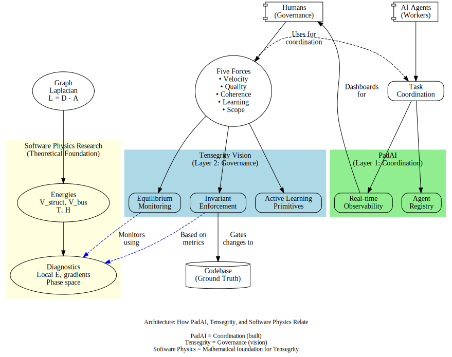

# Software Tensegrity MVP Simulator

## Overview

This directory contains the design and implementation for a **toy simulator** that treats software systems as tensegrity structures with graph-based energy dynamics.

**Purpose**: Validate that Laplacian-based structural metrics provide earlier warning signals than traditional per-node metrics.

**Status**: Design phase → Implementation starting



*The diagram above shows how this software physics research provides the theoretical foundation for Tensegrity governance (Layer 2), which sits on top of PadAI coordination infrastructure (Layer 1). See [../../docs/design/vision_architecture.md](../../docs/design/vision_architecture.md) for the full vision.*

## Documentation Structure

1. **[mvp-overview.md](./mvp-overview.md)** - Start here
   - Problem statement and motivation
   - Why build a simulator?
   - Scope and non-goals
   - Success criteria

2. **[mvp-model.md](./mvp-model.md)** - The physics
   - Fields: health, complexity, risk, demand, badness
   - Energies: V_struct, V_bus, T, H, L
   - Vector fields and flow
   - (See also: `../02-mathematical-foundations.md` and `../03-software-as-physics-mapping.md`)

3. **[mvp-simulation-design.md](./mvp-simulation-design.md)** - The mechanics
   - Actor types and policies
   - Event types and transformations
   - Simulation loop
   - State management

4. **[mvp-implementation.md](./mvp-implementation.md)** - How to build it
   - Tech stack (Python, NetworkX, NumPy, Matplotlib)
   - Code structure
   - Development phases
   - Quick start guide

5. **[mvp-scenarios.md](./mvp-scenarios.md)** - What to test
   - Baseline: healthy equilibrium
   - Competitor shock: demand shift + new requirement
   - Governance experiment: constrained vs unconstrained agents
   - Expected outcomes and metrics

## Quick Start

```bash
# Install dependencies
pip install networkx numpy matplotlib scipy

# Run baseline scenario
cd simulation
python scenarios/baseline.py

# Run competitor shock
python scenarios/competitor_shock.py

# Interactive exploration
jupyter notebook notebooks/mvp_demo.ipynb
```

## Key Concepts

**Graph**: Modules/services as nodes, dependencies as edges with coupling weights

**Fields**: Scalar (health, complexity, risk, demand) and vector (flow) functions over nodes

**Energies**:
- **V_struct** = ½ Σ w_ij(bad[i]-bad[j])² (tension from neighbors disagreeing)
- **V_bus** = Σ demand[i]·badness[i] (high-demand + bad state = pain)
- **T** = ½ Σ m_i(Δbad[i])² (rate of change energy)
- **H = T + V** (total system stress)

**Actors**: Humans and AI agents that fire events, guided by flow field

**Events**: FeatureChange, Refactor, AddEdge, RemoveEdge, AddConstraint, GovernanceChange

**Loop**: Discrete time: actors act → fields update → energies recompute → log → repeat

## Core Hypothesis

> **Local Dirichlet energy at high-centrality nodes predicts incidents earlier than global per-node metrics.**

Validation: Run competitor shock scenario, compare early warning from local V_struct at hubs vs. traditional metrics like average health or coverage.

## Next Steps

1. Implement graph_model.py with NetworkX
2. Define events and actors
3. Build simulation loop
4. Run baseline + competitor shock
5. Analyze trajectories: does H spike before "incidents"?  Does local energy at hubs warn earlier?

---

**See also**:
- `../01-motivation-and-core-insight.md` - Why software physics?
- `../02-mathematical-foundations.md` - Laplacian math deep dive
- `../03-software-as-physics-mapping.md` - Concrete examples and calculations
