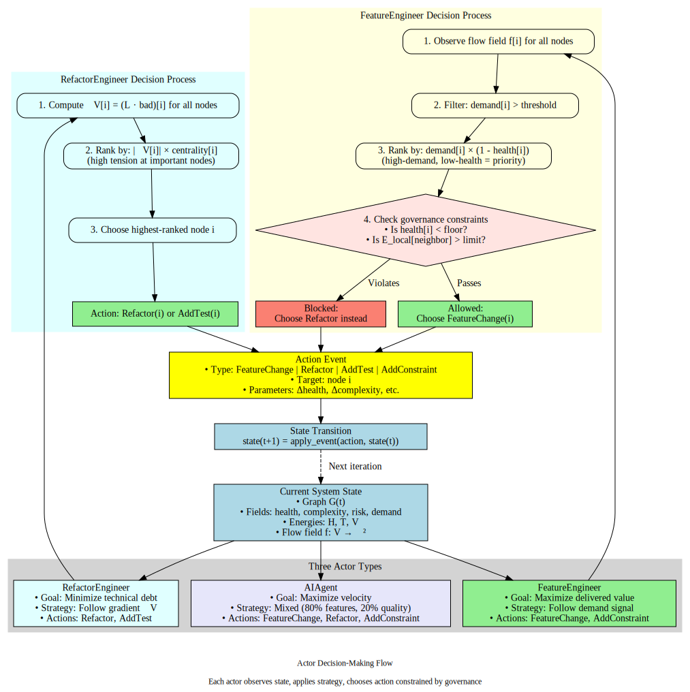
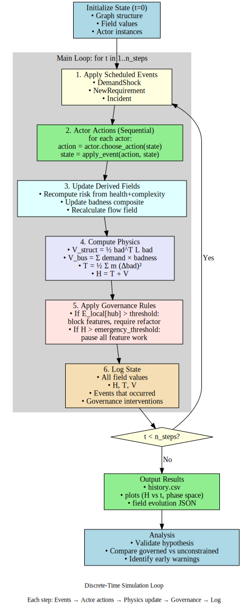

# MVP Simulator - Simulation Design

## Overview

This document specifies how the simulator operates: actor types, event primitives, the discrete-time loop, and state management.

**For the mathematical model** (fields, energies), see `mvp-model.md`.

**For implementation details** (code structure, tech stack), see `mvp-implementation.md`.

---

## 1. Actors - The Decision Makers

Actors observe the state (G, F) and choose actions. Each actor has a **policy** that determines what it does.



*The diagram above shows how actors observe state, apply their strategy, and choose actions constrained by governance rules. Each actor type follows a different decision process based on their goals.*

### 1.1 Feature Engineer (FE)

**Goal**: Ship features fast, respond to business demand

**Policy**:
- Choose nodes with probability ∝ `demand[i] + κ·random_noise`
- Heavily weight **business direction** component of `flow[i]`
- Prefer feature-building actions

**Action distribution**:
- 60% FeatureChange(i)
- 20% AddEdge(i, j) (add new dependency for feature)
- 15% Refactor(i) (clean up only when flow points strongly down)
- 5% Patch(i)

**Personality**: Velocity-focused, pragmatic, responds to user pressure

**Parameters**:
- `business_weight`: 0.8 (high sensitivity to demand)
- `stability_weight`: 0.2 (low sensitivity to structural tension)

### 1.2 Refactor Engineer (RE)

**Goal**: Improve code health, reduce technical debt, maintain architecture

**Policy**:
- Choose nodes with probability ∝ `|grad_V[i]| + κ·random_noise`
- Heavily weight **stability direction** component of `flow[i]`
- Prefer refactoring and constraint-adding actions

**Action distribution**:
- 60% Refactor(i)
- 20% AddConstraint(i) (add tests, contracts around node)
- 10% RemoveEdge(i, j) (decouple to reduce tension)
- 10% Patch(i)

**Personality**: Quality-focused, long-term thinking, responds to structural stress

**Parameters**:
- `business_weight`: 0.2
- `stability_weight`: 0.8

### 1.3 AI Agent (LLMA)

**Goal**: Maximize local flow magnitude (naive optimizer)

**Policy**:
- Choose node i with highest `||flow[i]||` (magnitude)
- Follow direction of flow **literally**, no nuance
- Slight bias toward feature work (default agent behavior)

**Action distribution**:
- Determined by `flow[i]` direction:
  - If flow.x > flow.y: FeatureChange(i)
  - If flow.y > flow.x: Refactor(i)
  - Ties: 60% feature, 40% refactor (bias)

**Personality**: Mechanical, follows gradients, no strategic thinking

**Parameters**:
- `feature_bias`: 0.6
- `magnitude_threshold`: 0.3 (only act if ||flow|| > threshold)

**Key difference from humans**: No context, no long-term memory, purely reactive to current flow field

### 1.4 Product Manager (Pseudo-Actor)

**Goal**: Inject external shocks (demand shifts, new requirements)

**Policy**:
- Scheduled events at specific time steps (not reactive to state)
- Represents market, competitive pressure, business strategy

**Actions**:
- DemandShock(i, Δ): Change demand[i]
- NewRequirement(zone): Add new node(s) with high demand

**Example schedule**:
```python
t=20: DemandShock(D_featureX, -0.4)  # Competitor steals users
t=20: NewRequirement(G_featureComp)  # Must respond
t=50: DemandShock(G_featureComp, +0.2)  # Users return
```

**Not a true actor**: Pre-scripted, deterministic

---

## 2. Events - State Transformations

Every event is a function `(G, F) → (G', F')` that mutates the graph and/or fields.

### 2.1 Field-Only Events (Topology Unchanged)

#### FeatureChange(i)
**Effect**:
```python
complexity[i] += 0.1
health[i] -= 0.05
risk[i] += 0.03
# Clamp all to [0,1]
```

**Represents**: Adding or modifying behavior at node i

**Typical ΔH**: +0.05 to +0.15 (increases both V_bus and V_struct if neighbors differ)

#### Refactor(i)
**Effect**:
```python
complexity[i] -= 0.1
health[i] += 0.08
risk[i] -= 0.05
# Clamp all to [0,1]
```

**Represents**: Structural cleanup, better tests, simplification

**Typical ΔH**: -0.03 to -0.10 (decreases V)

#### Patch(i)
**Effect**:
```python
health[i] += 0.03
risk[i] -= 0.02
```

**Represents**: Bug fixes, small improvements

**Typical ΔH**: -0.01 to -0.03 (minor improvement)

### 2.2 Structural Events (Topology Changes)

#### AddEdge(i, j)
**Effect on graph**:
```python
G.add_edge(i, j, weight=0.5)  # Medium coupling initially
```

**Side effects on fields**:
```python
risk[i] += 0.05  # New dependency adds risk
risk[j] += 0.05
```

**Laplacian change**: New off-diagonal entries, changed row sums

**Typical ΔH**: +0.02 to +0.08 (new coupling usually increases V_struct)

#### RemoveEdge(i, j)
**Effect on graph**:
```python
G.remove_edge(i, j)
```

**Side effects**:
```python
complexity[i] += 0.03  # Temporarily harder (boundaries shifting)
complexity[j] += 0.03
```

**Laplacian change**: Zero out off-diagonal, update row sums

**Typical ΔH**: +0.05 initially, then -0.08 after a few steps (decoupling pays off)

**Note**: Creates transient spike in H, then long-term reduction

#### SplitNode(i → i₁, i₂)
**Effect**:
- Create two new nodes i₁, i₂
- Distribute edges: some go to i₁, some to i₂ (heuristic: by edge type or random)
- Split fields: health, complexity, risk divided between new nodes

**Represents**: Breaking up a god-object or large module

**Typical ΔH**: +0.10 short-term (disruption), -0.15 long-term (better modularity)

**MVP status**: Optional—may skip for simplicity

#### MergeNodes(i, j → k)
**Effect**:
- Create new node k with union of edges from i and j
- Sum or average fields from i and j

**Represents**: Consolidation, sometimes creates god-objects

**Typical ΔH**: Variable—can be good (DRY) or bad (tight coupling)

**MVP status**: Optional

### 2.3 Constraint Events (Change Tension Network)

#### AddConstraint(i)
**Effect on graph**:
```python
for edge in G.edges_touching(i):
    edge.weight *= 1.2  # 20% stiffer
```

**Side effects**:
```python
health[i] += 0.05  # More tests/contracts improve health
```

**Represents**: Adding tests, contracts, observability, architectural rules

**Typical ΔH**: +0.01 short-term (tighter coupling), -0.05 long-term (constraints prevent drift)

**Tradeoff**: Stiffer springs → higher V_struct if neighbors differ, but also prevent further divergence

#### GovernanceChange(pattern)
**Effect**: Modify allowed action set for future steps

**Example patterns**:
- `"no_new_edges_to_db"`: Block AddEdge(i, C_db) for all i
- `"refactor_before_feature_at_hub"`: If local V_struct[hub] > threshold, only Refactor allowed at hub
- `"coverage_gate"`: If health[i] < 0.5, block FeatureChange(i)

**Represents**: New coding standards, review requirements, architectural principles

**Implementation**: Flags or filters in actor decision logic

**Typical ΔH**: Depends on rule—gates usually reduce T (less motion) and V (constrained motion is smoother)

### 2.4 Environment Events (External Forces)

#### DemandShock(i, Δ)
**Effect**:
```python
demand[i] += Δ
demand[i] = clamp(demand[i], 0, 1)
```

**Represents**: Market shift, user migration, competitive pressure, viral feature

**Typical ΔH**: Changes V_bus (demand-weighted badness), also rotates flow field

**Does NOT directly change graph or code fields**: Purely external signal

#### NewRequirement(zone)
**Effect**:
- Add new node(s) to graph in specified zone
- Set high demand on new node(s)
- Optionally add edges to existing nodes

**Represents**: Product decision, regulatory mandate, new OKR, competitive response

**Example**:
```python
G.add_node('G_featureComp')
demand['G_featureComp'] = 0.8
health['G_featureComp'] = 0.5  # New code, moderate quality
complexity['G_featureComp'] = 0.3
risk['G_featureComp'] = 0.4
```

**Typical ΔH**: Large spike (new high-demand node with moderate badness → high V_bus)

---

## 3. The Simulation Loop



*The diagram above shows the discrete-time simulation loop: scheduled events → actor actions → update derived fields → compute physics → apply governance → log → repeat.*

### 3.1 Discrete Time Stepping

**Structure**: For each time step k = 0, 1, 2, ..., N:

```python
def simulation_step(k, state, actors, scheduled_events):
    """Single discrete time step."""

    # 1. Apply scheduled environment events (if any)
    for event in scheduled_events.get(k, []):
        state = apply_event(event, state)

    # 2. Each actor chooses and applies an action
    for actor in actors:
        # Actor observes current state
        action = actor.choose_action(state)

        # Apply action to state
        state = apply_event(action, state)

    # 3. Recompute derived quantities
    state.bad = compute_badness(state.fields)
    state.grad_V = compute_gradient(state.graph, state.bad)
    state.flow = compute_flow(state.grad_V, state.demand)

    # 4. Recompute energies
    state.V_struct = compute_structural_potential(state.graph, state.bad)
    state.V_bus = compute_business_potential(state.demand, state.bad)
    state.V = state.V_struct + state.V_bus

    state.T = compute_kinetic_energy(state.bad, state.bad_prev)
    state.H = state.T + state.V
    state.L = state.T - state.V

    # 5. Compute diagnostics
    state.E_local = {i: local_dirichlet_energy(state.graph, state.bad, i)
                     for i in state.graph.nodes}

    # 6. Check for incidents (stochastic)
    incidents = check_incidents(state)

    # 7. Log everything
    log_state(k, state, incidents)

    # 8. Update prev state for next step
    state.bad_prev = state.bad.copy()

    return state
```

### 3.2 Actor Action Selection

**For Feature Engineer**:
```python
def choose_action(self, state):
    # Compute scores for each node
    scores = {}
    for i in state.graph.nodes:
        score = 0.8 * state.demand[i] + 0.2 * random.random()
        scores[i] = score

    # Sample node proportional to score
    node = weighted_sample(scores)

    # Choose action type based on flow
    flow_x, flow_y = state.flow[node]

    if flow_x > 0.5:  # Strong business pressure
        return FeatureChange(node)
    elif flow_y > 0.3:  # Some stability pressure
        if random.random() < 0.3:
            return Refactor(node)
        else:
            return FeatureChange(node)
    else:
        # Default: features
        return FeatureChange(node)
```

**For Refactor Engineer**:
```python
def choose_action(self, state):
    # Compute scores based on gradient magnitude
    scores = {}
    for i in state.graph.nodes:
        score = 0.8 * abs(state.grad_V[i]) + 0.2 * random.random()
        scores[i] = score

    node = weighted_sample(scores)

    # Refactor engineers always refactor or constrain
    if random.random() < 0.75:
        return Refactor(node)
    else:
        return AddConstraint(node)
```

**For AI Agent**:
```python
def choose_action(self, state):
    # Find node with highest flow magnitude
    max_flow = 0
    best_node = None
    for i in state.graph.nodes:
        flow_mag = norm(state.flow[i])
        if flow_mag > max_flow:
            max_flow = flow_mag
            best_node = i

    if max_flow < self.magnitude_threshold:
        return NoOp()  # Don't act if flow too weak

    # Follow flow direction
    flow_x, flow_y = state.flow[best_node]

    if flow_x > flow_y:
        return FeatureChange(best_node)
    else:
        return Refactor(best_node)
```

### 3.3 Incident Model (Stochastic)

**Simple version**:
```python
def check_incidents(state):
    incidents = []
    for i in state.graph.nodes:
        # Probability of incident ∝ risk × demand
        p_incident = state.risk[i] * state.demand[i] * Δt

        if random.random() < p_incident:
            incidents.append({
                'node': i,
                'severity': state.risk[i],
                'impact': state.demand[i],
            })

    return incidents
```

**Interpretation**: High-risk, high-demand modules fail more often

**Effects of incidents**:
- Log for analysis
- Optionally trigger governance response (AddConstraint at failing node)
- Increase risk temporarily at incident site

---

## 4. State Management

### 4.1 State Object

```python
class SimulationState:
    def __init__(self, graph, fields):
        # Graph structure
        self.graph = graph  # NetworkX graph
        self.laplacian = compute_laplacian(graph)

        # Scalar fields
        self.health = fields['health']
        self.complexity = fields['complexity']
        self.risk = fields['risk']
        self.demand = fields['demand']

        # Derived fields
        self.bad = compute_badness(fields)
        self.bad_prev = self.bad.copy()  # For kinetic energy

        # Vector field
        self.grad_V = compute_gradient(self.graph, self.bad)
        self.flow = compute_flow(self.grad_V, self.demand)

        # Energies
        self.V_struct = 0.0
        self.V_bus = 0.0
        self.V = 0.0
        self.T = 0.0
        self.H = 0.0
        self.L = 0.0

        # Diagnostics
        self.E_local = {}  # Per-node local Dirichlet energy

        # History (for logging)
        self.history = []
```

### 4.2 Logging Strategy

**Per-step log entry**:
```python
{
    'step': k,
    'H': state.H,
    'T': state.T,
    'V': state.V,
    'V_struct': state.V_struct,
    'V_bus': state.V_bus,
    'L': state.L,
    'fields': {
        node: {
            'health': state.health[node],
            'complexity': state.complexity[node],
            'risk': state.risk[node],
            'demand': state.demand[node],
            'bad': state.bad[node],
            'flow': state.flow[node],
            'E_local': state.E_local[node],
        }
        for node in state.graph.nodes
    },
    'incidents': incidents,
    'events': events_this_step,
}
```

**Output**:
- CSV for time series (H, T, V, etc.)
- JSON for detailed per-node history
- Pickle for full state snapshots (for replay/debugging)

---

## 5. Governance Modes

### 5.1 Unconstrained Mode (Baseline)

**Policy**: Actors can do anything, no gates

**Expected dynamics**:
- High velocity (lots of FeatureChange)
- H rises if FE + LLMA dominate
- V_struct spikes at hubs
- Incidents more frequent

**Use**: Establish baseline, show what happens without governance

### 5.2 Governed Mode (Experimental)

**Policy**: Add gates based on structural metrics

**Example gates**:
1. **Hub protection**: If `E_local[hub] > 0.5`, only Refactor allowed at hub until energy drops
2. **Health floor**: If `health[i] < 0.4`, block FeatureChange(i) until health improves
3. **H ceiling**: If `H > 2.0`, pause all actors for 5 steps (emergency brake)
4. **Coupling limit**: Block AddEdge if it would create cycle or increase max degree beyond threshold

**Expected dynamics**:
- Lower peak H (gates prevent runaway)
- More refactors (enforced by gates)
- Fewer incidents (higher health maintained)
- Longer cycle time (gates slow things down)

**Tradeoff**: Velocity vs. stability

### 5.3 Adaptive Mode (Future)

**Policy**: Dynamically adjust gates based on observed H, T/V ratio

**Example**:
- If `T/V > 2`: "Too cowboy, tighten gates"
- If `T/V < 0.5`: "Too bureaucratic, loosen gates"
- If `H increasing for 10 steps`: "Inject refactors"

**Implementation**: Meta-controller that adjusts gate thresholds each N steps

**Goal**: Automatically find equilibrium for given context

---

## 6. Visualization During Simulation

### 6.1 Real-Time Graph View

**Tool**: NetworkX + Matplotlib (or Plotly for interactive)

**Rendering**:
- Node color: badness (red = high, green = low)
- Node size: demand (big = high demand)
- Edge thickness: weight (thick = tight coupling)
- Vector arrows: flow[i] direction

**Update**: Every N steps or at key events

### 6.2 Time Series Plots

**Metrics to plot**:
- H, T, V vs. time (primary diagnostic)
- V_struct and V_bus separately
- T/V ratio
- Average health, complexity, risk
- Incident count per window

**Tool**: Matplotlib subplots

### 6.3 Phase Space Plot

**Axes**: T vs. V (or H vs. some other variable)

**Trace**: Plot (T(k), V(k)) for k = 0..N

**Interpretation**: Trajectory through phase space reveals regime

- Stable orbit → healthy equilibrium
- Spiral outward → runaway
- Stuck in corner → frozen or chaotic

---

## 7. Pseudo-Code Summary

```python
# Initialize
state = initialize_state(graph, fields)
actors = [FeatureEngineer(), RefactorEngineer(), AIAgent()]
scheduled = load_scenario('competitor_shock')

# Main loop
for k in range(N_steps):
    # Environment events
    for event in scheduled.get(k, []):
        state = apply_event(event, state)

    # Actors act
    for actor in actors:
        action = actor.choose_action(state)
        state = apply_event(action, state)

    # Recompute
    state.update_derived_fields()
    state.update_energies()
    state.check_incidents()

    # Log
    log(k, state)

    # Visualize (every 10 steps)
    if k % 10 == 0:
        visualize(state)

# Post-process
plot_timeseries(state.history)
plot_phase_space(state.history)
export_csv(state.history)
```

---

## 8. Next Steps

**Implementation**:
1. Define actor classes in `actors.py`
2. Define event functions in `events.py`
3. Implement simulation loop in `simulation.py`
4. Wire up logging and visualization in `visualization.py`

**Testing**:
- Unit test each event (does it mutate state correctly?)
- Unit test each actor policy (does it choose sensible actions?)
- Integration test: run 10-step simulation, check energies are sane

**Scenarios**:
- See `mvp-scenarios.md` for detailed scenario definitions

**See also**:
- `mvp-model.md` - Mathematical definitions
- `mvp-implementation.md` - Code structure and tech stack
